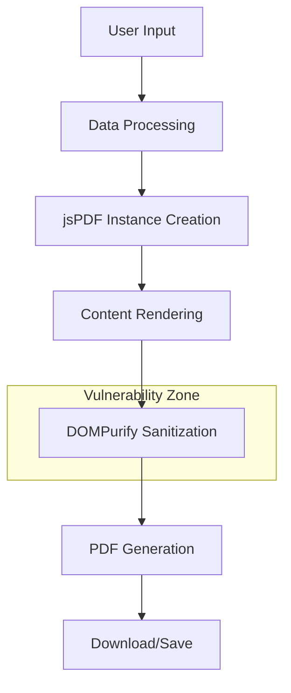

# jsPDF Vulnerability Fix Design

## Overview

This design addresses the critical security vulnerability CVE-2025-26791 in the jsPDF dependency, which affects the PDF generation functionality in the Synaptix Studio website application. The vulnerability stems from a transitive dependency on DOMPurify@2.5.8, which allows Cross-site Scripting (XSS) attacks with a CVSS score of 4.5/10 (Medium severity).

The application currently uses jsPDF@2.5.2 for generating PDF reports in two key features:
- Website Auditor PDF reports
- AI Strategy Report downloads

## Vulnerability Assessment

### Current Dependency Analysis

| Component | Current Version | Vulnerability Source | Risk Level |
|-----------|----------------|---------------------|------------|
| jsPDF | 2.5.2 | Transitive dependency | Medium |
| DOMPurify | 2.5.8 | CVE-2025-26791 | Medium |

### Affected Components

The vulnerability impacts the following application components:

1. **AIWebsiteAuditorSection**: Uses jsPDF to generate downloadable audit reports
2. **ContactSection**: Uses jsPDF to create AI strategy reports with custom formatting

### Security Impact Analysis

The XSS vulnerability in DOMPurify could potentially allow malicious content to be injected into generated PDF documents, particularly when processing user-generated content such as:
- Website audit results containing external content
- User-provided business information in strategy reports
- Dynamic content from API responses

## Architecture Impact

### Current PDF Generation Flow

### Risk Assessment Matrix

| Risk Factor | Current Impact | Likelihood | Severity |
|-------------|----------------|------------|----------|
| User Content Injection | Medium | Medium | Medium |
| External API Data | Medium | Low | Medium |
| Template Rendering | Low | Low | Low |
| File Download Security | Medium | Medium | Medium |

## Remediation Strategy

### Approach 1: Dependency Update (Recommended)

Update jsPDF to the latest stable version that includes a patched DOMPurify dependency.

**Benefits:**
- Maintains existing functionality
- Minimal code changes required
- Leverages official security patches

**Considerations:**
- Verify compatibility with existing PDF generation logic
- Test all PDF formatting and styling features
- Validate image embedding functionality

### Approach 2: Alternative PDF Library Migration

Evaluate and migrate to alternative PDF generation libraries with better security profiles.

**Candidate Libraries:**
- PDFKit-js: Lightweight, secure alternative
- React-PDF: React-specific PDF generation
- Puppeteer: Headless browser-based PDF generation

**Trade-offs:**
- Significant code refactoring required
- Potential feature parity gaps
- Learning curve for new API

### Approach 3: Enhanced Input Sanitization

Implement additional input validation and sanitization layers before PDF generation.

**Implementation Strategy:**
- Pre-sanitize all user inputs
- Validate API response content
- Implement content security policies
- Add runtime security checks

## Implementation Plan

### Phase 1: Immediate Security Patch

1. **Dependency Analysis**
   - Audit current jsPDF version compatibility
   - Identify minimum version requirements for vulnerability fix
   - Review breaking changes in newer versions

2. **Version Update Process**
   - Update package.json dependency specification
   - Test PDF generation functionality
   - Validate existing feature compatibility

3. **Regression Testing**
   - Verify AIWebsiteAuditorSection PDF downloads
   - Test ContactSection strategy report generation
   - Validate PDF formatting and styling
   - Confirm image embedding functionality

### Phase 2: Enhanced Security Measures

1. **Input Validation Enhancement**
   - Implement strict content validation before PDF generation
   - Add XSS protection for dynamic content
   - Sanitize external API responses

2. **Security Monitoring**
   - Add logging for PDF generation processes
   - Implement content security headers
   - Monitor for suspicious content patterns

### Phase 3: Long-term Security Architecture

1. **Security Review Process**
   - Establish regular dependency security audits
   - Implement automated vulnerability scanning
   - Create security update procedures

2. **Content Security Policy**
   - Define allowed content sources
   - Implement CSP headers for PDF content
   - Establish content validation rules

## Testing Strategy

### Security Testing Requirements

| Test Category | Test Cases | Expected Outcome |
|---------------|------------|------------------|
| XSS Prevention | Malicious script injection | Content sanitized |
| Input Validation | Special characters, HTML tags | Proper escaping |
| PDF Integrity | Generated file structure | Valid PDF format |
| Content Security | External content inclusion | Controlled rendering |

### Functional Testing Validation

1. **PDF Generation Functionality**
   - Website audit reports maintain formatting
   - Strategy reports preserve styling
   - Image embedding continues working
   - Download functionality remains intact

2. **Cross-browser Compatibility**
   - PDF generation works across browsers
   - Download triggers function properly
   - Content rendering is consistent

3. **Performance Impact Assessment**
   - PDF generation speed unchanged
   - Memory usage within acceptable limits
   - Large report handling maintains performance

## Risk Mitigation

### Security Controls

| Control Type | Implementation | Purpose |
|--------------|----------------|---------|
| Input Sanitization | Pre-processing validation | Prevent malicious content |
| Version Pinning | Exact dependency versions | Control security updates |
| Content Security Policy | Strict content rules | Limit XSS vectors |
| Security Headers | HTTP security headers | Additional protection layers |

### Monitoring and Detection

1. **Runtime Security Monitoring**
   - Log PDF generation events
   - Monitor for suspicious content patterns
   - Track security-related errors

2. **Dependency Management**
   - Automated security scanning
   - Regular vulnerability assessments
   - Update notification system

## Success Criteria

### Security Objectives

- [ ] CVE-2025-26791 vulnerability eliminated
- [ ] No regression in PDF generation functionality
- [ ] Enhanced input validation implemented
- [ ] Security monitoring established

### Functional Requirements

- [ ] AIWebsiteAuditorSection PDF downloads work correctly
- [ ] ContactSection strategy reports generate properly
- [ ] All PDF formatting and styling preserved
- [ ] Image embedding functionality maintained
- [ ] Cross-browser compatibility verified

### Performance Benchmarks

- [ ] PDF generation time within 10% of current performance
- [ ] Memory usage remains within acceptable limits
- [ ] Large report processing maintains responsiveness
- [ ] No degradation in user experience