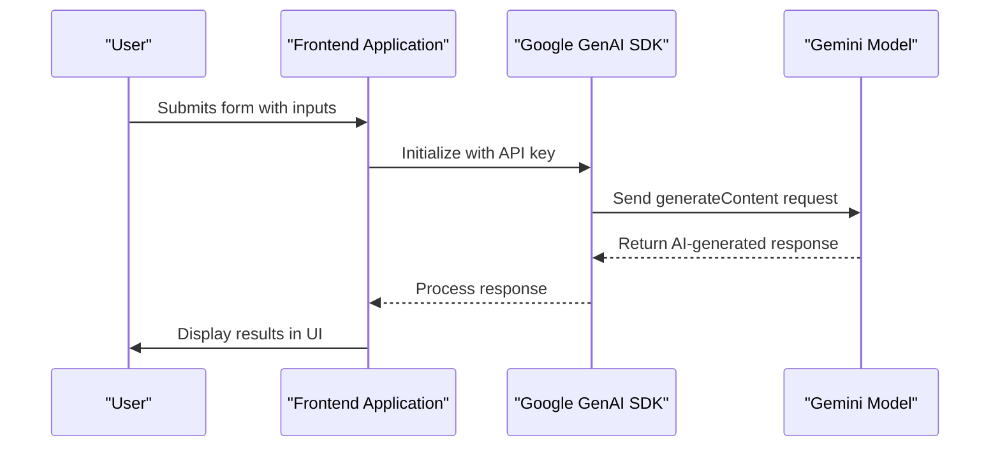
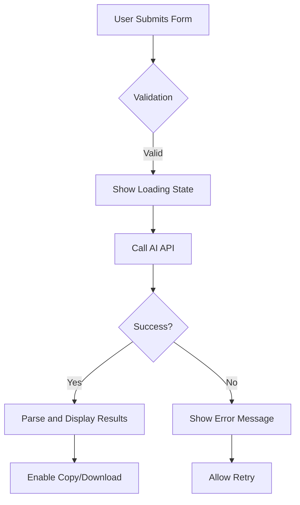
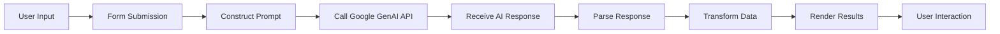

# AI Tools Reference

<cite>
**Referenced Files in This Document**   
- [AIAdCopyGeneratorSection.tsx](file://components/AIAdCopyGeneratorSection.tsx)
- [AIEmailSubjectLineTesterSection.tsx](file://components/AIEmailSubjectLineTesterSection.tsx)
- [AIIdeaGeneratorSection.tsx](file://components/AIIdeaGeneratorSection.tsx)
- [AIWebsiteAuditorSection.tsx](file://components/AIWebsiteAuditorSection.tsx)
- [AIKnowledgeBaseGeneratorSection.tsx](file://components/AIKnowledgeBaseGeneratorSection.tsx)
- [AIQuizSection.tsx](file://components/AIQuizSection.tsx)
- [constants.tsx](file://constants.tsx)
- [analytics.ts](file://services/analytics.ts)
- [StyledText.tsx](file://components/StyledText.tsx)
- [MarkdownRenderer.tsx](file://components/MarkdownRenderer.tsx)
- [DynamicLoader.tsx](file://components/DynamicLoader.tsx)
</cite>

## Table of Contents
1. [Introduction](#introduction)
2. [Core AI Tools Overview](#core-ai-tools-overview)
3. [Implementation Details](#implementation-details)
4. [UI/UX Patterns](#uiux-patterns)
5. [Data Flow Analysis](#data-flow-analysis)
6. [Use Cases and Best Practices](#use-cases-and-best-practices)
7. [Performance Considerations](#performance-considerations)
8. [Conclusion](#conclusion)

## Introduction
Synaptix Studio provides a comprehensive suite of AI-powered tools designed to help businesses leverage artificial intelligence for marketing, strategy, and operational efficiency. These tools utilize Google GenAI to process user inputs and generate valuable outputs across various business functions. The AI tools are accessible through an intuitive web interface and are designed to deliver immediate value while demonstrating the potential of intelligent automation. This document provides a detailed reference for the suite of AI tools, explaining their purpose, implementation, user interface patterns, and optimal usage strategies.

## Core AI Tools Overview

### Ad Copy Generator
The Ad Copy Generator is an AI tool that creates multiple high-converting ad variations for digital marketing campaigns. Users provide information about their product, target audience, key benefits, and preferred ad platform (Facebook/Instagram, Google Ads, or LinkedIn Ads). The AI, acting as an expert direct response copywriter, generates three distinct ad copy variations, each using a different marketing angle: Problem-Agitate-Solve (PAS), Benefit-Driven, or Social Proof. For each variation, the tool provides a headline, body copy, image suggestion for AI image generation, and an alternative call-to-action for A/B testing.

**Section sources**
- [AIAdCopyGeneratorSection.tsx](file://components/AIAdCopyGeneratorSection.tsx#L52-L217)

### Email Subject Line Tester
The Email Subject Line Tester analyzes the effectiveness of email subject lines and provides actionable feedback to improve open rates. Users input their subject line and can optionally provide context about their target audience and email topic. The AI, functioning as an expert email marketing analyst, scores the subject line's "Open Rate Potential" on a scale of 0-100 and provides a detailed analysis of its clarity, urgency, curiosity, and spam risk. The tool also generates three improved subject line suggestions tailored to the provided context, helping users optimize their email marketing campaigns.

**Section sources**
- [AIEmailSubjectLineTesterSection.tsx](file://components/AIEmailSubjectLineTesterSection.tsx#L41-L213)

### Idea Generator
The Idea Generator acts as an AI business strategist that provides actionable AI automation ideas based on a user's business context. Users select their industry, business size, primary goal, and describe their key challenge. The AI generates three strategic AI solution ideas, each with a catchy title, description, tangible business impact, concrete first steps for implementation, a relevant icon, potential risks, estimated timeframe, and an explanation of why the idea fits their specific business context. This tool helps businesses overcome analysis paralysis and identify high-impact automation opportunities.

**Section sources**
- [AIIdeaGeneratorSection.tsx](file://components/AIIdeaGeneratorSection.tsx#L73-L248)

### Website Auditor
The Website Auditor conducts a comprehensive AI-powered analysis of a website's SEO, user experience, and conversion optimization. Users input their website URL and select their business type. The AI, acting as a world-class SEO and CRO specialist, uses Google Search to analyze the site and generates a structured report with an executive summary, overall score, and detailed analysis of technical SEO, UX, and content. The report includes actionable recommendations prioritized by impact (High, Medium, Low) and can be downloaded as a PDF. This tool provides instant strategic insights for website improvement.

**Section sources**
- [AIWebsiteAuditorSection.tsx](file://components/AIWebsiteAuditorSection.tsx#L277-L437)

### Knowledge Base Generator
The Knowledge Base Generator transforms any website into a structured, AI-ready knowledge base. Users input a URL, and the AI crawls the site to analyze its content. The tool generates a comprehensive knowledge base document in Markdown format, including a summary, metadata (company name, tone of voice, primary services), logical sections, detailed articles, and FAQs. The output is presented in an interactive report with copy-to-clipboard functionality, making it easy to use the generated content to train AI agents or create documentation.

**Section sources**
- [AIKnowledgeBaseGeneratorSection.tsx](file://components/AIKnowledgeBaseGeneratorSection.tsx#L243-L361)

### Quiz Generator
The Quiz Generator assesses a business's AI readiness and automation maturity through a short questionnaire. Users answer six multiple-choice questions about their marketing, sales, and operations processes. The AI analyzes the responses and generates a personalized report with an automation score (0-100), a maturity level assessment (Nascent, Beginner, Intermediate, Advanced), a detailed analysis of their current situation, and three top AI opportunity recommendations. Each opportunity includes a description, impact, and actionable first steps, providing a clear roadmap for AI adoption.

**Section sources**
- [AIQuizSection.tsx](file://components/AIQuizSection.tsx#L42-L216)

## Implementation Details

### Google GenAI Integration
All AI tools in the Synaptix Studio suite are implemented using the Google GenAI SDK to interface with the Gemini 2.5 Flash model. The integration follows a consistent pattern across all tools: a `GoogleGenAI` instance is created with the API key from environment variables (`import.meta.env.VITE_GEMINI_API_KEY`), and the `generateContent` method is called with a carefully crafted system instruction and user prompt. The system instruction defines the AI's role (e.g., "expert direct response copywriter") and specifies the exact output format, ensuring consistent and predictable responses.

**Diagram sources**
- [AIAdCopyGeneratorSection.tsx](file://components/AIAdCopyGeneratorSection.tsx#L52-L217)
- [AIEmailSubjectLineTesterSection.tsx](file://components/AIEmailSubjectLineTesterSection.tsx#L41-L213)

### Response Structure and Validation
To ensure reliable parsing of AI responses, most tools use structured output formats with JSON schema validation. The `responseMimeType` is set to `application/json`, and a `responseSchema` is defined to specify the expected structure of the JSON object. This approach prevents parsing errors and ensures the frontend receives data in a predictable format. For tools that generate Markdown content (Website Auditor, Knowledge Base Generator), the system instruction defines a strict Markdown template that the AI must follow, which is then parsed by custom parsing functions (`parseAuditMarkdown`, `parseMarkdownToKB`) to extract structured data for display.

**Section sources**
- [AIAdCopyGeneratorSection.tsx](file://components/AIAdCopyGeneratorSection.tsx#L52-L217)
- [AIEmailSubjectLineTesterSection.tsx](file://components/AIEmailSubjectLineTesterSection.tsx#L41-L213)
- [AIWebsiteAuditorSection.tsx](file://components/AIWebsiteAuditorSection.tsx#L277-L437)
- [AIKnowledgeBaseGeneratorSection.tsx](file://components/AIKnowledgeBaseGeneratorSection.tsx#L243-L361)

### Error Handling and Analytics
The tools implement robust error handling to manage API failures and unexpected responses. When an error occurs during AI processing, the user is presented with a friendly error message, and the error is logged to the console. The application also tracks user interactions using Google Analytics via the `trackEvent` function in `analytics.ts`. Events are recorded for key actions such as generating ad copy, testing a subject line, or generating a business idea, providing valuable insights into tool usage and user engagement.

**Section sources**
- [AIAdCopyGeneratorSection.tsx](file://components/AIAdCopyGeneratorSection.tsx#L52-L217)
- [analytics.ts](file://services/analytics.ts#L30-L39)

## UI/UX Patterns

### Input Forms and Controls
The AI tools follow a consistent UI pattern with a two-column layout on larger screens: an input form on the left and results display on the right. The input forms use a clean, accessible design with clearly labeled fields, appropriate input types (text, textarea, select), and visual feedback for required fields. Platform-specific controls, such as button groups for ad platform selection, provide an intuitive way to make selections. Form validation ensures all required fields are filled before submission, with error messages displayed prominently.

**Section sources**
- [AIAdCopyGeneratorSection.tsx](file://components/AIAdCopyGeneratorSection.tsx#L52-L217)
- [AIEmailSubjectLineTesterSection.tsx](file://components/AIEmailSubjectLineTesterSection.tsx#L41-L213)

### Results Display and Feedback
Results are displayed in a visually engaging manner with a consistent loading state across all tools. The `DynamicLoader` component shows a spinning animation and rotating messages (e.g., "Generating ad variations...") to provide feedback during AI processing. Once results are available, they are presented in card-based layouts with appropriate styling and spacing. Tools like the Email Subject Line Tester use the `ViralityMeter` component to visualize scores, while the Website Auditor presents its report in an accordion format for easy navigation of different sections.

**Diagram sources**
- [DynamicLoader.tsx](file://components/DynamicLoader.tsx#L1-L31)
- [AIEmailSubjectLineTesterSection.tsx](file://components/AIEmailSubjectLineTesterSection.tsx#L41-L213)

### Copy-to-Clipboard and Export Functionality
Several tools include functionality to copy results to the clipboard or export them. The Knowledge Base Generator features a "Copy Markdown" button that copies the entire generated knowledge base to the clipboard, with visual feedback ("Copied!") when successful. The Website Auditor includes a "Download PDF" button that uses the jsPDF library to generate a PDF report from the audit results. These features enhance the utility of the tools by making it easy for users to take their results and use them in other contexts.

**Section sources**
- [AIKnowledgeBaseGeneratorSection.tsx](file://components/AIKnowledgeBaseGeneratorSection.tsx#L243-L361)
- [AIWebsiteAuditorSection.tsx](file://components/AIWebsiteAuditorSection.tsx#L277-L437)

## Data Flow Analysis

### User Interaction to AI Processing
The data flow for all AI tools follows a similar pattern. When a user submits a form, the input values are collected and used to construct a user prompt. This prompt, along with a system instruction that defines the AI's role and output format, is sent to the Google GenAI API. The AI processes the input and generates a response, which is returned to the frontend. The response is then parsed (either as JSON or Markdown) and transformed into a format suitable for display in the UI. Finally, the results are rendered, and the user can interact with them (e.g., copy to clipboard, download).

**Diagram sources**
- [AIAdCopyGeneratorSection.tsx](file://components/AIAdCopyGeneratorSection.tsx#L52-L217)
- [AIEmailSubjectLineTesterSection.tsx](file://components/AIEmailSubjectLineTesterSection.tsx#L41-L213)

### State Management and Effects
The tools use React's `useState` and `useRef` hooks for state management and DOM references. The `useOnScreen` hook is used to detect when a section becomes visible, triggering animations for a smoother user experience. The `useEffect` hook is used to scroll to the results section when they become available, ensuring the user's attention is directed to the output. This consistent use of React patterns ensures a responsive and interactive user interface across all tools.

**Section sources**
- [AIAdCopyGeneratorSection.tsx](file://components/AIAdCopyGeneratorSection.tsx#L52-L217)
- [AIEmailSubjectLineTesterSection.tsx](file://components/AIEmailSubjectLineTesterSection.tsx#L41-L213)

## Use Cases and Best Practices

### Ad Copy Generator Use Cases
The Ad Copy Generator is ideal for marketers creating digital advertising campaigns. Best practices include providing specific, detailed information about the product and target audience, experimenting with different ad platforms to see how the AI tailors the copy, and using the generated image suggestions as prompts for AI image generation tools. Users should also test the alternative CTAs provided by the tool in A/B tests to optimize conversion rates.

### Email Subject Line Tester Use Cases
This tool is valuable for email marketers looking to improve open rates. Best practices include testing subject lines before sending campaigns, providing context about the audience and topic for more relevant suggestions, and using the spam risk analysis to avoid common pitfalls. Users should also experiment with different versions of their subject lines to see how small changes affect the score and recommendations.

### Idea Generator Use Cases
The Idea Generator is useful for business owners and leaders exploring AI automation. Best practices include being honest about business challenges, considering all three generated ideas even if they seem unconventional, and using the first steps as a starting point for implementation. The tool is particularly effective for businesses feeling overwhelmed by AI possibilities and needing a clear direction.

### Website Auditor Use Cases
The Website Auditor is beneficial for website owners and digital marketers seeking to improve their online presence. Best practices include auditing competitor websites for benchmarking, using the actionable recommendations as a prioritized to-do list, and downloading the PDF report to share with stakeholders. The tool provides a quick, high-level assessment that can inform more detailed manual audits.

### Knowledge Base Generator Use Cases
This tool is ideal for businesses wanting to create training materials or documentation from existing web content. Best practices include using URLs with comprehensive information (e.g., about pages, service pages), reviewing the generated knowledge base for accuracy, and using it as a foundation for training AI agents. The tool saves significant time compared to manually creating documentation.

### Quiz Generator Use Cases
The Quiz Generator helps businesses assess their AI readiness. Best practices include taking the quiz with a team for more accurate answers, using the personalized report as a discussion starter for strategy sessions, and treating the opportunity recommendations as a starting point for deeper exploration. The tool provides a non-technical way to understand AI's potential impact.

## Performance Considerations

### AI Processing Latency
The performance of the AI tools is primarily constrained by the latency of the Google GenAI API. The tools implement loading states with animated spinners and rotating messages to manage user expectations during processing. The use of the Gemini 2.5 Flash model, which is optimized for speed, helps minimize wait times. However, users should expect processing times of several seconds, especially for more complex tasks like website auditing, which requires external search.

### Frontend Optimization
The frontend is optimized for performance with lazy loading of components and efficient state management. The use of React's `useMemo` hook in components like `StyledText` and `MarkdownRenderer` prevents unnecessary re-renders. The tools also implement smooth animations and transitions to create a polished user experience without sacrificing performance. Network requests are minimized by batching operations where possible, and the application is designed to handle errors gracefully to maintain usability.

**Section sources**
- [StyledText.tsx](file://components/StyledText.tsx#L1-L73)
- [MarkdownRenderer.tsx](file://components/MarkdownRenderer.tsx#L1-L76)

## Conclusion
The AI tools provided by Synaptix Studio represent a powerful suite of applications that leverage Google GenAI to deliver immediate value to businesses. By following consistent implementation patterns and UI/UX principles, these tools provide a seamless user experience while demonstrating the practical applications of AI in marketing, strategy, and operations. The tools are designed to be accessible to users of all technical levels, with intuitive interfaces and clear guidance. As AI technology continues to evolve, these tools will serve as a foundation for more advanced automation solutions, helping businesses work smarter and achieve greater efficiency.