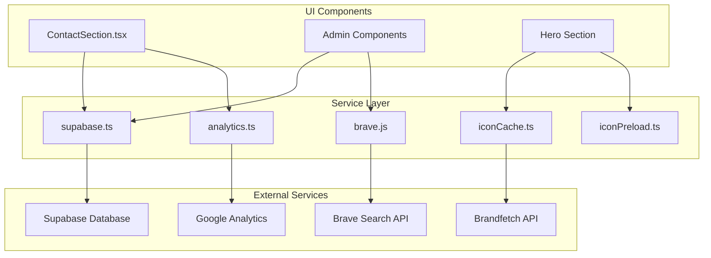

# API Integration Layer

<cite>
**Referenced Files in This Document**   
- [supabase.ts](file://services/supabase.ts)
- [analytics.ts](file://services/analytics.ts)
- [brave.js](file://api/brave.js)
- [ContactSection.tsx](file://components/ContactSection.tsx)
- [iconCache.ts](file://services/iconCache.ts)
- [iconPreload.ts](file://services/iconPreload.ts)
</cite>

## Table of Contents
1. [Introduction](#introduction)
2. [Service Layer Architecture](#service-layer-architecture)
3. [Supabase Integration](#supabase-integration)
4. [Google Analytics Implementation](#google-analytics-implementation)
5. [Brave Search API Integration](#brave-search-api-integration)
6. [Icon Management System](#icon-management-system)
7. [Component Integration Examples](#component-integration-examples)
8. [Error Handling and Reliability](#error-handling-and-reliability)
9. [Security Considerations](#security-considerations)
10. [Best Practices for New Integrations](#best-practices-for-new-integrations)

## Introduction
The API integration architecture of the Synaptix Studio website implements a robust service layer pattern that encapsulates external API interactions, data persistence, and analytics tracking. This document details the implementation of dedicated service modules for Supabase, Google Analytics, and icon management, along with the secure integration of the Brave Search API. The architecture follows separation of concerns principles, providing clean interfaces between UI components and backend services while ensuring security, reliability, and maintainability.

## Service Layer Architecture
The service layer pattern implemented in the `/services` directory provides a unified interface for all external API interactions, abstracting complexity from UI components. This architecture enables consistent error handling, centralized configuration management, and improved testability. The services are designed as stateless modules that can be imported and used across components, with each service responsible for a specific domain of functionality.



**Diagram sources**
- [services/supabase.ts](file://services/supabase.ts)
- [services/analytics.ts](file://services/analytics.ts)
- [services/iconCache.ts](file://services/iconCache.ts)
- [services/iconPreload.ts](file://services/iconPreload.ts)
- [api/brave.js](file://api/brave.js)
- [components/ContactSection.tsx](file://components/ContactSection.tsx)

**Section sources**
- [services/supabase.ts](file://services/supabase.ts)
- [services/analytics.ts](file://services/analytics.ts)
- [services/iconCache.ts](file://services/iconCache.ts)
- [services/iconPreload.ts](file://services/iconPreload.ts)
- [api/brave.js](file://api/brave.js)

## Supabase Integration
The `supabase.ts` service encapsulates all database operations for blog content and user data, providing a clean interface for CRUD operations and authentication. The service uses the Supabase client SDK to interact with the PostgreSQL database, with all operations wrapped in a consistent error handling pattern.

The implementation includes specialized functions for different data models, including form submissions (strategy leads, contact leads, newsletter signups), blog post management, and referral code validation. Each operation includes comprehensive logging for debugging purposes and handles common error scenarios such as row-level security violations.

```mermaid
classDiagram
class SupabaseService {
+SUPABASE_URL : string
+SUPABASE_ANON_KEY : string
+supabase : SupabaseClient
+supabaseRequest(table, data) : Promise~void~
+saveStrategyLead(formData) : Promise~void~
+saveContactLead(formData) : Promise~void~
+saveNewsletter(formData) : Promise~void~
+getBlogPosts() : Promise~BlogPost[]~
+saveBlogPost(post) : Promise~BlogPost~
+deleteBlogPost(postId) : Promise~void~
+checkReferralCode(code) : Promise~boolean~
}
class BlogPost {
+id? : number
+slug : string
+title : string
+description : string
+category : string
+image : string
+content : string
+keywords? : string
+externalLinks? : {platform, url, text}[]
+created_at? : string
+performance_data? : PerformanceData
+last_analyzed_at? : string
}
class PerformanceData {
+summary : string
+metrics : {name, value, insight}[]
+recommendations : {recommendation, priority}[]
}
SupabaseService --> "1" BlogPost : manages
SupabaseService --> "1" PerformanceData : includes
note right of SupabaseService
Encapsulates all Supabase database operations
with consistent error handling and logging
end
```

**Diagram sources**
- [services/supabase.ts](file://services/supabase.ts#L11-L277)

**Section sources**
- [services/supabase.ts](file://services/supabase.ts#L1-L277)

## Google Analytics Implementation
The `analytics.ts` service provides a wrapper around Google Analytics (gtag) for tracking page views and custom events. The implementation includes type safety through TypeScript declarations and graceful degradation when the analytics function is not available.

The service exposes two primary functions: `trackPageView` for monitoring navigation and `trackEvent` for capturing user interactions with specific components and features. Each tracking call includes comprehensive logging for debugging in development environments, while maintaining performance in production.

```mermaid
sequenceDiagram
participant Component as "UI Component"
participant Analytics as "analytics.ts"
participant GA as "Google Analytics"
Component->>Analytics : trackEvent("generate_ai_strategy", {website_provided : true})
Analytics->>Analytics : Log event to console
alt gtag available
Analytics->>GA : window.gtag('event', 'generate_ai_strategy', {...})
GA-->>Analytics : Event recorded
else gtag not available
Analytics-->>Component : No operation (safe fallback)
end
Analytics-->>Component : Tracking complete
Component->>Analytics : trackPageView("/blog", "AI Strategy Guide")
Analytics->>Analytics : Log page view to console
alt gtag available
Analytics->>GA : window.gtag('event', 'page_view', {...})
GA-->>Analytics : Page view recorded
else gtag not available
Analytics-->>Component : No operation (safe fallback)
end
Analytics-->>Component : Tracking complete
note right of Analytics
All analytics calls include
development logging and
production-safe execution
end
```

**Diagram sources**
- [services/analytics.ts](file://services/analytics.ts#L1-L39)

**Section sources**
- [services/analytics.ts](file://services/analytics.ts#L1-L39)

## Brave Search API Integration
The Brave Search API integration has been migrated to a secure serverless architecture using Vercel Functions, eliminating client-side exposure of API keys. The `brave.js` file in the `/api` directory serves as a serverless function that proxies requests to the Brave Search API, protecting the `BRAVE_API_KEY` environment variable.

This architecture provides several security and performance benefits, including API key protection, proper CORS configuration, server-side rate limiting, and elimination of dependency on external CORS proxy services. The implementation includes comprehensive error handling with appropriate HTTP status codes and logging for debugging.

```mermaid
sequenceDiagram
participant Client as "Client App"
participant Vercel as "Vercel Function (/api/brave.js)"
participant Brave as "Brave Search API"
Client->>Vercel : GET /api/brave?q=AI+tools
Vercel->>Vercel : Validate CORS headers
Vercel->>Vercel : Check query parameter
Vercel->>Vercel : Verify BRAVE_API_KEY exists
Vercel->>Brave : Fetch with API key
alt Brave API successful
Brave-->>Vercel : Return search results
Vercel-->>Client : 200 OK with data
else Brave API error
Brave-->>Vercel : Error response
Vercel->>Vercel : Log error
Vercel-->>Client : 4xx/5xx with error message
end
alt Invalid method
Vercel-->>Client : 405 Method Not Allowed
end
alt Missing query
Vercel-->>Client : 400 Bad Request
end
note right of Vercel
Server-side integration protects
API keys and provides reliable
search functionality
end
```

**Diagram sources**
- [api/brave.js](file://api/brave.js#L1-L55)

**Section sources**
- [api/brave.js](file://api/brave.js#L1-L55)

## Icon Management System
The icon management system consists of two complementary services: `iconCache.ts` and `iconPreload.ts`. These services work together to optimize the loading and display of partner and client logos from the Brandfetch API.

The `IconCacheService` implements a sophisticated caching strategy with a 24-hour cache duration, preventing duplicate requests and improving performance. It validates image URLs before caching and handles loading states to prevent UI blocking. The service uses a singleton pattern with periodic cleanup of expired cache entries.

The `IconPreloadService` optimizes perceived performance by preloading critical icons that appear above the fold, reducing layout shifts and improving user experience. It processes icons in batches with timeouts to prevent overwhelming the browser and includes fallback mechanisms for failed preloads.

```mermaid
flowchart TD
A["Start Preload Critical Icons"] --> B{Preload Started?}
B --> |Yes| C[Return existing promise]
B --> |No| D[Set preloadStarted = true]
D --> E[Get current theme]
E --> F[Get critical icons]
F --> G{More batches?}
G --> |Yes| H[Process batch with timeout]
H --> I[Wait 100ms between batches]
I --> G
G --> |No| J["✅ Preload complete"]
K[Fetch Icon] --> L{Cached and valid?}
L --> |Yes| M[Return cached URL]
L --> |No| N{Loading in progress?}
N --> |Yes| O[Return existing promise]
N --> |No| P[Create loading promise]
P --> Q[Fetch from Brandfetch API]
Q --> R{Image loads?}
R --> |Yes| S[Cache valid URL]
S --> T[Return URL]
R --> |No| U[Cache invalid result]
U --> V[Throw error]
style J fill:#D5E8D4,stroke:#82B366
style T fill:#D5E8D4,stroke:#82B366
style V fill:#F8CECC,stroke:#B85450
note right of K
IconCacheService handles
individual icon requests
end
note right of A
IconPreloadService manages
batch preloading
end
```

**Diagram sources**
- [services/iconCache.ts](file://services/iconCache.ts#L13-L140)
- [services/iconPreload.ts](file://services/iconPreload.ts#L10-L160)

**Section sources**
- [services/iconCache.ts](file://services/iconCache.ts#L1-L151)
- [services/iconPreload.ts](file://services/iconPreload.ts#L1-L167)

## Component Integration Examples
UI components interact with the service layer through well-defined interfaces, demonstrating the effectiveness of the service layer pattern. The `ContactSection` component serves as a prime example, integrating multiple services to provide a comprehensive user experience.

When a user submits the AI strategy form, the component orchestrates interactions with both Supabase and Google Analytics services. It first validates the form data, then generates an AI-powered strategy using the Gemini API, saves the results to Supabase, and tracks the event in Google Analytics. The component also manages loading states and provides user feedback through success messages and interactive elements.

```mermaid
sequenceDiagram
participant User as "User"
participant ContactSection as "ContactSection.tsx"
participant Supabase as "supabase.ts"
participant Analytics as "analytics.ts"
participant Gemini as "Gemini API"
User->>ContactSection : Fill form and click "Generate My AI Plan"
ContactSection->>ContactSection : Validate form fields
alt Valid form
ContactSection->>ContactSection : Set loading state
ContactSection->>Gemini : Generate AI strategy with website analysis
Gemini-->>ContactSection : Return AI-generated strategy
ContactSection->>Supabase : saveStrategyLead(formData + AIResponse)
Supabase-->>ContactSection : Success confirmation
ContactSection->>Analytics : trackEvent("generate_ai_strategy")
Analytics-->>ContactSection : Tracking complete
ContactSection->>ContactSection : Display AI strategy
ContactSection->>ContactSection : Scroll to results
else Invalid form
ContactSection->>User : Display error message
end
User->>ContactSection : Click "Download PDF"
ContactSection->>ContactSection : Generate PDF with jsPDF
ContactSection->>Analytics : trackEvent("download_ai_strategy_pdf")
Analytics-->>ContactSection : Tracking complete
ContactSection->>User : Download PDF file
User->>ContactSection : Click "Copy Report"
ContactSection->>ContactSection : Copy to clipboard
ContactSection->>Analytics : trackEvent("copy_ai_strategy_report")
Analytics-->>ContactSection : Tracking complete
ContactSection->>ContactSection : Show "Copied!" feedback
note right of ContactSection
Orchestration of multiple services
with proper state management
and user feedback
end
```

**Diagram sources**
- [components/ContactSection.tsx](file://components/ContactSection.tsx#L12-L397)
- [services/supabase.ts](file://services/supabase.ts#L38-L39)
- [services/analytics.ts](file://services/analytics.ts#L32-L38)

**Section sources**
- [components/ContactSection.tsx](file://components/ContactSection.tsx#L1-L399)

## Error Handling and Reliability
The API integration layer implements comprehensive error handling strategies to ensure reliability and provide meaningful feedback. Each service includes try-catch blocks around asynchronous operations, with specific error handling for common scenarios.

The Supabase service provides detailed error messages for row-level security violations, guiding developers to create appropriate policies. The Brave Search API integration includes server-side error handling with proper HTTP status codes and client-side fallbacks. The icon management system gracefully handles failed image loads by caching invalid results to prevent repeated failed requests.

Loading states are managed at the component level, with the `ContactSection` using React state to control the display of a dynamic loader during AI strategy generation. Retry mechanisms are implemented through user-initiated actions rather than automatic retries, preventing potential abuse of external APIs.

## Security Considerations
Security is a primary concern in the API integration architecture, with several measures implemented to protect sensitive information and prevent abuse. The most significant security enhancement is the migration of the Brave Search API integration to a serverless architecture, which protects the `BRAVE_API_KEY` by keeping it in server-side environment variables.

The Supabase integration uses the anonymous key for client-side operations, with row-level security policies controlling data access at the database level. All form submissions are validated on the client side, and the server-side Supabase policies provide additional validation.

API key management follows best practices, with keys stored in environment variables and never exposed in client-side code. The architecture eliminates the use of CORS proxies, which previously exposed API keys in browser network requests. Rate limiting is handled at the server level for the Brave Search API, preventing potential abuse.

## Best Practices for New Integrations
When adding new API integrations to the application, follow these guidelines to maintain consistency and security:

1. **Server-Side Integration**: For any API requiring authentication keys, implement a serverless function in the `/api` directory to proxy requests and protect credentials.

2. **Service Layer Pattern**: Create a dedicated service file in the `/services` directory that encapsulates all interactions with the external API, providing a clean interface for components.

3. **Error Handling**: Implement comprehensive error handling with meaningful messages and appropriate fallback behavior. Log errors for debugging but provide user-friendly messages.

4. **Type Safety**: Use TypeScript interfaces to define data structures and function signatures, ensuring type safety throughout the application.

5. **Performance Optimization**: Implement caching strategies for frequently accessed data and consider preloading for critical above-the-fold content.

6. **Analytics Integration**: Track key user interactions with the new feature using the analytics service to measure adoption and effectiveness.

7. **Security Review**: Ensure no sensitive information is exposed in client-side code and validate all inputs to prevent injection attacks.

8. **Testing**: Implement comprehensive tests for the service layer and component integration, covering both success and error scenarios.