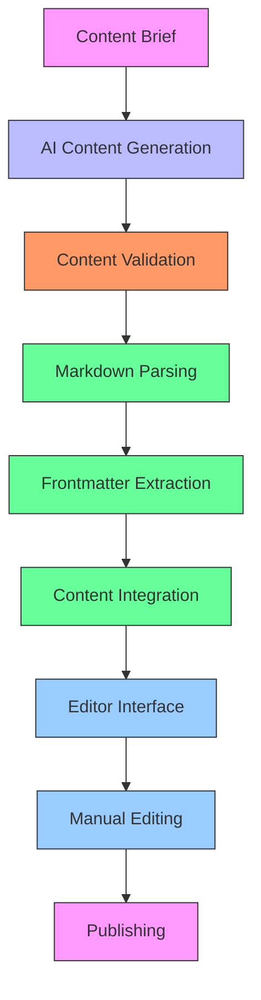
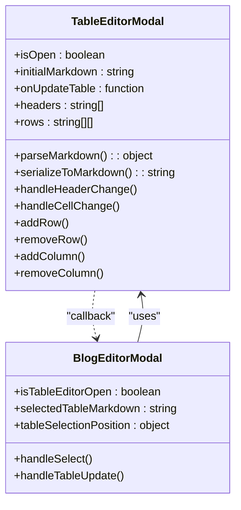
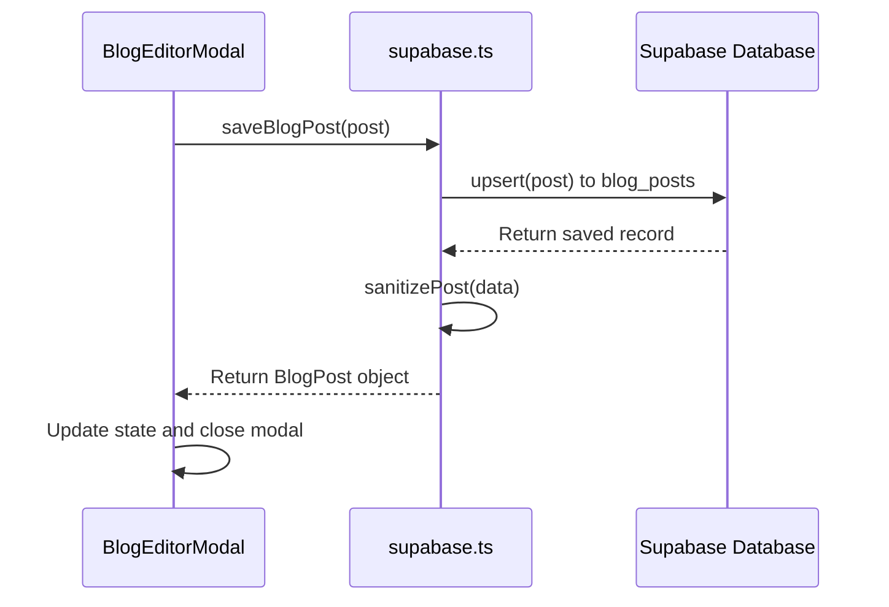

# Admin Dashboard Guide

<cite>
**Referenced Files in This Document**   
- [BlogAdminDashboard.tsx](file://components/admin/BlogAdminDashboard.tsx)
- [PasswordModal.tsx](file://components/admin/PasswordModal.tsx)
- [BlogEditorModal.tsx](file://components/admin/BlogEditorModal.tsx)
- [TableEditorModal.tsx](file://components/admin/TableEditorModal.tsx)
- [supabase.ts](file://services/supabase.ts)
</cite>

## Table of Contents
1. [Introduction](#introduction)
2. [Authentication and Access Control](#authentication-and-access-control)
3. [Blog Content Management](#blog-content-management)
4. [AI-Powered Content Creation](#ai-powered-content-creation)
5. [Structured Data Management](#structured-data-management)
6. [UI Design Patterns and User Experience](#ui-design-patterns-and-user-experience)
7. [Backend Integration and Data Flow](#backend-integration-and-data-flow)
8. [Security Considerations](#security-considerations)
9. [Potential System Extensions](#potential-system-extensions)
10. [Conclusion](#conclusion)

## Introduction
The Admin Dashboard provides a comprehensive interface for managing content on the Synaptix Studio website. This guide details the functionality of the administrative components, focusing on blog content management, AI tool links, and structured data tables. The system is designed to streamline content creation and optimization through integrated AI tools while maintaining robust security measures. Administrators can create, edit, and publish blog posts using AI-assisted workflows, manage internal and external links for SEO optimization, and edit structured data through a visual table editor. The dashboard features multiple views for content strategy development, performance analysis, and direct content editing, providing a complete suite of tools for content management.

## Authentication and Access Control
The administrative interface is protected by a password-based authentication system implemented through the PasswordModal component. This modal presents a simple login interface that verifies user credentials against a predefined password constant. The authentication mechanism is designed for single-user access, making it suitable for a backend-free environment where complex user management is not required. When an administrator attempts to access protected functionality, the PasswordModal is displayed, requiring the correct password to proceed. Upon successful authentication, the user gains access to all administrative features, including content creation, editing, and deletion. The system does not implement session persistence, requiring re-authentication upon page refresh. This approach balances security needs with implementation simplicity, though it should be enhanced for production environments with multiple users or more stringent security requirements.

**Section sources**
- [PasswordModal.tsx](file://components/admin/PasswordModal.tsx#L15-L67)

## Blog Content Management
The BlogAdminDashboard component serves as the central hub for managing blog content, providing a comprehensive interface for viewing, creating, editing, and deleting blog posts. The dashboard displays a table of all existing posts with key information including title, category, creation date, and action buttons. Administrators can perform various operations on posts, including previewing content, editing details, copying content to clipboard, and deleting posts with confirmation. The interface supports multiple views accessible through navigation tabs, including "All Posts," "Create New Post," "AI Content Strategist," and "Performance Optimizer." Each post can be edited through the BlogEditorModal, which provides a rich text editing experience with markdown support. The system also includes functionality for generating new content ideas through AI analysis of existing content and optimizing post performance through simulated analytics. The dashboard's responsive design ensures usability across different device sizes, with a clean, intuitive interface that prioritizes essential content management functions.

**Section sources**
- [BlogAdminDashboard.tsx](file://components/admin/BlogAdminDashboard.tsx#L715-L938)

## AI-Powered Content Creation
The administrative interface incorporates AI-powered tools to assist with content creation and optimization through the BlogEditorModal component. The AI Content Writer feature allows administrators to generate article drafts by providing a strategic brief including topic, target audience, keywords, and desired tone. This functionality leverages the Google GenAI API to create comprehensive blog posts that adhere to the "Synaptix Studio Blog Blueprint," ensuring consistent quality and SEO optimization. The AI generates content with proper structure, including headings, tables, FAQs, and client testimonials, while following strict formatting guidelines. The editor also includes an AI Toolkit with multiple optimization features, such as a QA Report that analyzes content against quality standards, a Headline Virality Analyzer that suggests improved headlines, and tools for audience and keyword suggestion. These AI-powered features work together to enhance content quality, improve SEO performance, and streamline the content creation process. The system validates AI-generated content to ensure it meets formatting requirements before integration into the editor, maintaining consistency across all published content.

**Diagram sources**
- [BlogEditorModal.tsx](file://components/admin/BlogEditorModal.tsx#L26-L302)
- [BlogEditorModal.tsx](file://components/admin/BlogEditorModal.tsx#L54-L87)
- [BlogEditorModal.tsx](file://components/admin/BlogEditorModal.tsx#L89-L143)

**Section sources**
- [BlogEditorModal.tsx](file://components/admin/BlogEditorModal.tsx#L26-L302)

## Structured Data Management
The administrative interface includes a dedicated TableEditorModal component for managing structured data within blog content. This visual editor allows administrators to create and modify markdown tables without requiring direct markdown editing. The interface presents a spreadsheet-like view where users can edit table headers and cells, add or remove rows and columns, and preview changes in real-time. The editor parses existing markdown tables into a structured format, enabling intuitive manipulation of table data. When a user selects a markdown table in the content editor, the TableEditorModal automatically opens with the table data loaded, allowing for easy modifications. The system ensures table integrity by validating that all rows have the same number of columns as the header row, preventing common formatting errors. After editing, the updated table is serialized back to markdown format and reinserted into the content at the original position. This approach simplifies table management, making it accessible to users without markdown expertise while maintaining the structural requirements for proper rendering on the website.

**Diagram sources**
- [TableEditorModal.tsx](file://components/admin/TableEditorModal.tsx#L10-L26)
- [TableEditorModal.tsx](file://components/admin/TableEditorModal.tsx#L28-L39)
- [BlogEditorModal.tsx](file://components/admin/BlogEditorModal.tsx#L787-L810)
- [BlogEditorModal.tsx](file://components/admin/BlogEditorModal.tsx#L836-L851)

**Section sources**
- [TableEditorModal.tsx](file://components/admin/TableEditorModal.tsx#L41-L148)

## UI Design Patterns and User Experience
The administrative interface employs consistent UI design patterns to enhance usability and provide a cohesive user experience. Modal dialogs are used extensively for focused tasks, with a layered approach where primary modals (like the BlogEditorModal) can open secondary modals (like the TableEditorModal or Link Manager). The interface uses a tabbed navigation system within modals to switch between different views, such as the AI Toolkit and content preview in the BlogEditorModal. Form validation is implemented through real-time feedback and error messages, with required fields clearly indicated. The system provides visual feedback for all user interactions, including loading states, success indicators, and confirmation dialogs for destructive actions. The design follows a responsive approach, adapting layout and functionality based on screen size. Interactive elements use consistent styling and behavior, with hover states and visual cues to indicate clickable areas. The interface also includes accessibility features such as proper ARIA attributes, keyboard navigation support, and semantic HTML structure. These design patterns work together to create an intuitive and efficient content management experience.

**Section sources**
- [BlogEditorModal.tsx](file://components/admin/BlogEditorModal.tsx#L709-L1012)
- [TableEditorModal.tsx](file://components/admin/TableEditorModal.tsx#L41-L148)

## Backend Integration and Data Flow
The administrative components interact with the Supabase backend through a services layer that abstracts database operations. The supabase.ts file exports functions for retrieving, saving, updating, and deleting blog posts, handling the conversion between JavaScript objects and database records. When a blog post is saved, the system upserts the data into the 'blog_posts' table, using the slug as a conflict key to support both creation and updates. The service layer includes error handling and logging to assist with debugging, providing detailed messages for common issues like row-level security violations. The data flow follows a consistent pattern: UI components call service functions, which interact with the Supabase client, and return promises that are handled by the components. For blog posts, the system manages complex data types like JSON for external links and performance data, serializing and deserializing these values as needed. The service layer also includes a sanitizePost function to ensure data integrity when retrieving records from the database. This architecture provides a clean separation between the UI and data access layers, making the system maintainable and extensible.

**Diagram sources**
- [supabase.ts](file://services/supabase.ts#L193-L230)
- [BlogEditorModal.tsx](file://components/admin/BlogEditorModal.tsx#L709-L1012)

**Section sources**
- [supabase.ts](file://services/supabase.ts#L173-L276)

## Security Considerations
The administrative system implements several security measures to protect sensitive functionality and data. The primary security mechanism is the password-based authentication through PasswordModal, which restricts access to administrative features. However, this approach has limitations, as the password is stored as a constant in the client-side code, making it vulnerable to exposure. For production environments, this should be replaced with server-side authentication. The system uses Supabase's row-level security to control database access, with policies requiring explicit permissions for operations like insert, update, and delete. The service layer includes input validation and error handling to prevent common vulnerabilities, though additional server-side validation would enhance security. The interface implements confirmation dialogs for destructive actions like post deletion, preventing accidental data loss. All API calls to external services are made through a proxy endpoint to protect API keys, though the current implementation could be enhanced with additional security headers and rate limiting. The system should also implement proper session management and consider role-based access control for multi-user scenarios.

**Section sources**
- [PasswordModal.tsx](file://components/admin/PasswordModal.tsx#L15-L67)
- [supabase.ts](file://services/supabase.ts#L173-L276)

## Potential System Extensions
The administrative system can be extended in several ways to enhance functionality and usability. Additional content types could be supported, such as case studies, whitepapers, or product pages, each with their own specialized editing interfaces and validation rules. The AI content generation system could be expanded to support multiple AI providers or models, allowing administrators to choose the best option for different content types. Advanced analytics integration could provide real performance data from external sources like Google Analytics, replacing the current simulated data. The system could implement version control and content scheduling, allowing draft management and future publishing. Collaboration features like user roles, permissions, and edit history could support team-based content creation. The table editor could be enhanced with support for more complex data types, formulas, or data import/export functionality. Integration with external content management systems or headless CMS platforms could provide additional flexibility. These extensions would build upon the existing architecture while maintaining the core principles of usability and AI-assisted content creation.

## Conclusion
The Admin Dashboard provides a comprehensive suite of tools for managing content on the Synaptix Studio website, combining intuitive UI design with powerful AI-assisted functionality. The system enables efficient content creation and management through features like AI-powered drafting, visual table editing, and automated SEO optimization. While the current implementation effectively meets the core requirements for blog content management, there are opportunities to enhance security, expand functionality, and improve the overall user experience. The modular architecture and clear separation of concerns make the system well-suited for future extensions and improvements. By leveraging AI capabilities while maintaining human oversight, the administrative interface strikes a balance between automation and control, empowering content creators to produce high-quality, optimized content efficiently.