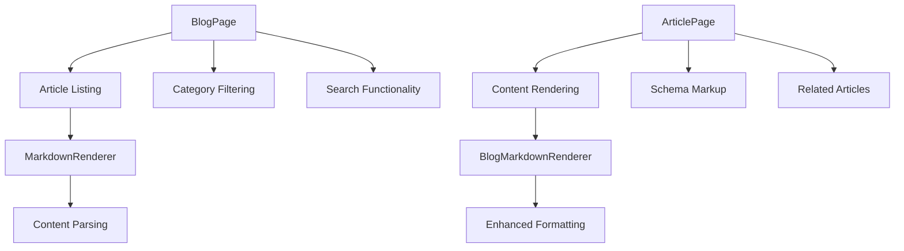
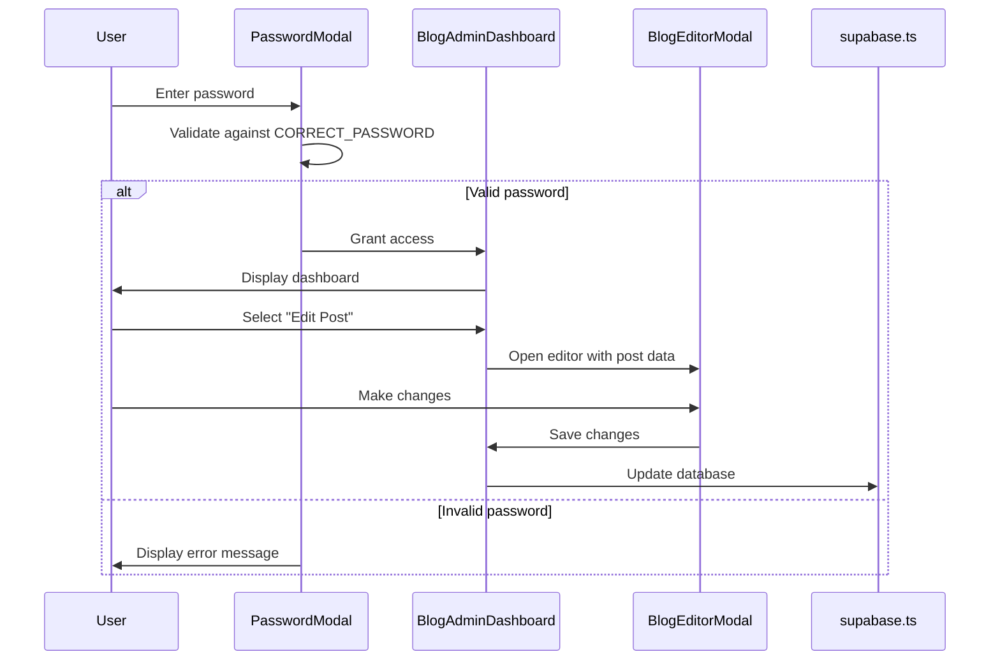
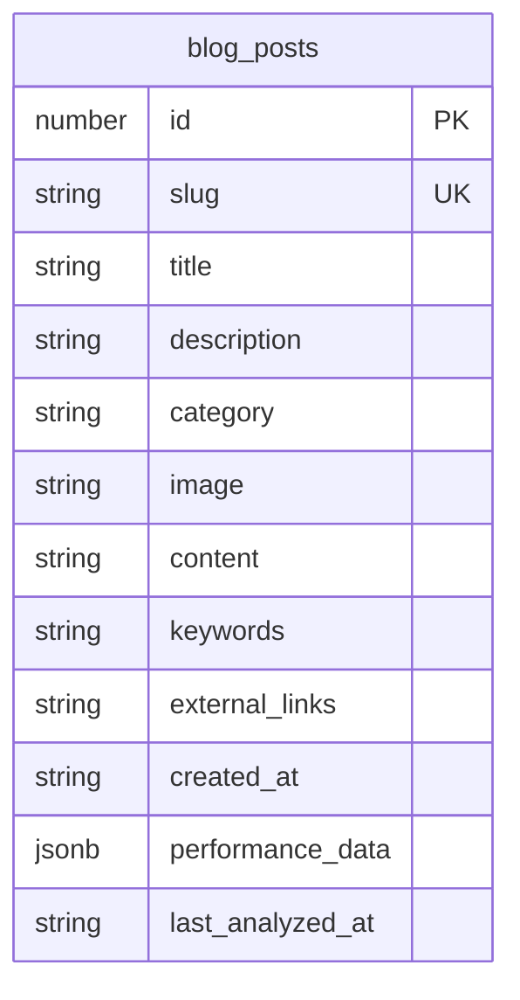
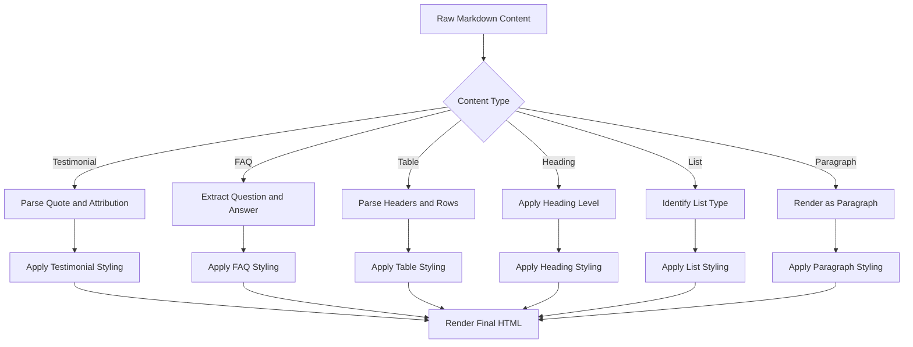

# Blog Management System

<cite>
**Referenced Files in This Document**   
- [BlogPage.tsx](file://components/BlogPage.tsx)
- [ArticlePage.tsx](file://components/ArticlePage.tsx)
- [MarkdownRenderer.tsx](file://components/MarkdownRenderer.tsx)
- [BlogMarkdownRenderer.tsx](file://components/BlogMarkdownRenderer.tsx)
- [BlogAdminDashboard.tsx](file://components/admin/BlogAdminDashboard.tsx)
- [PasswordModal.tsx](file://components/admin/PasswordModal.tsx)
- [BlogEditorModal.tsx](file://components/admin/BlogEditorModal.tsx)
- [supabase.ts](file://services/supabase.ts)
</cite>

## Table of Contents
1. [Introduction](#introduction)
2. [Blog Content Architecture](#blog-content-architecture)
3. [Admin Interface and Authentication](#admin-interface-and-authentication)
4. [Content Storage and Retrieval](#content-storage-and-retrieval)
5. [Markdown Parsing Implementation](#markdown-parsing-implementation)
6. [SEO and URL Routing](#seo-and-url-routing)
7. [Performance Optimization](#performance-optimization)
8. [Authoring Guidelines](#authoring-guidelines)

## Introduction
The Synaptix Studio blog management system enables seamless publishing and administration of content through a secure, feature-rich interface. This system combines frontend components for content display with backend services for data persistence, allowing authors to create, edit, and publish articles efficiently. The architecture supports rich content formatting via Markdown, integrates SEO best practices, and provides administrative tools for content oversight and performance analysis.

## Blog Content Architecture

The blog functionality is structured around two primary components: BlogPage for article listing and ArticlePage for individual post rendering. BlogPage organizes content into categories such as Featured, Latest, and topic-specific sections, implementing intelligent filtering and search capabilities. The component displays articles in a responsive grid layout, with featured content algorithmically selected to ensure category diversity and recency.

ArticlePage handles the rendering of individual blog posts, incorporating structured data markup for SEO and providing related content suggestions. The page includes schema.org metadata for improved search engine indexing and features a "Read Next" section that displays three additional articles, enhancing user engagement and content discoverability.

**Diagram sources**
- [BlogPage.tsx](file://components/BlogPage.tsx#L54-L203)
- [ArticlePage.tsx](file://components/ArticlePage.tsx#L21-L166)

**Section sources**
- [BlogPage.tsx](file://components/BlogPage.tsx#L54-L203)
- [ArticlePage.tsx](file://components/ArticlePage.tsx#L21-L166)

## Admin Interface and Authentication

The BlogAdminDashboard provides comprehensive content management capabilities, including post creation, editing, deletion, and performance analysis. Access to the admin interface is secured through PasswordModal, which implements client-side authentication with a hardcoded password. This authentication mechanism prevents unauthorized access to sensitive content management functions.

The dashboard features multiple views: "All Posts" for content inventory, "Create New Post" for article generation, "AI Content Strategist" for topic ideation, and "Performance Optimizer" for analytics. BlogEditorModal enables rich content editing with support for title, description, category, image, and Markdown content. The interface includes a preview function that renders content using BlogMarkdownRenderer before publication.

**Diagram sources**
- [PasswordModal.tsx](file://components/admin/PasswordModal.tsx#L15-L67)
- [BlogAdminDashboard.tsx](file://components/admin/BlogAdminDashboard.tsx#L715-L938)
- [BlogEditorModal.tsx](file://components/admin/BlogEditorModal.tsx#L709-L1012)

**Section sources**
- [BlogAdminDashboard.tsx](file://components/admin/BlogAdminDashboard.tsx#L715-L938)
- [PasswordModal.tsx](file://components/admin/PasswordModal.tsx#L15-L67)

## Content Storage and Retrieval

Blog data is stored in Supabase, a PostgreSQL-based backend-as-a-service platform. The system uses the supabase.ts service to handle all database operations, including retrieving, saving, and deleting blog posts. The blog_posts table contains fields for slug, title, description, category, image URL, content, keywords, external links, and performance data.

The getBlogPosts function retrieves all articles ordered by creation date, while saveBlogPost upserts content using the slug as a conflict key, ensuring idempotent operations. The deleteBlogPost function removes articles by ID with confirmation to prevent accidental deletion. External links are stored as JSON strings and parsed upon retrieval, maintaining data integrity while supporting flexible link management.

**Diagram sources**
- [supabase.ts](file://services/supabase.ts#L173-L276)

**Section sources**
- [supabase.ts](file://services/supabase.ts#L173-L276)

## Markdown Parsing Implementation

The system implements two Markdown rendering components: MarkdownRenderer for basic parsing and BlogMarkdownRenderer for enhanced content processing. BlogMarkdownRenderer supports advanced formatting features including testimonials, FAQs, tables, headings, and lists. Testimonials are parsed from [TESTIMONIAL_START] to [TESTIMONIAL_END] blocks, while FAQs are identified by **Q:** prefixes.

Tables are rendered from Markdown syntax with header alignment and responsive overflow handling. The parser processes content in blocks separated by blank lines, ensuring proper handling of complex formatting. Both renderers use the StyledText component for consistent typography and apply Tailwind CSS classes for visual styling, including prose classes for optimal text readability.

**Diagram sources**
- [BlogMarkdownRenderer.tsx](file://components/BlogMarkdownRenderer.tsx#L8-L153)
- [MarkdownRenderer.tsx](file://components/MarkdownRenderer.tsx#L9-L74)

**Section sources**
- [BlogMarkdownRenderer.tsx](file://components/BlogMarkdownRenderer.tsx#L8-L153)

## SEO and URL Routing

The blog system implements comprehensive SEO practices to maximize content visibility. ArticlePage includes JSON-LD structured data with Article schema, specifying headline, image, author, publisher, and description. This semantic markup helps search engines understand content context and improves rich snippet display in search results.

URL routing follows a clean, hierarchical pattern with the format /blog/{slug}, where slug is a URL-friendly version of the article title. The system maintains consistent internal linking, with navigation elements connecting the blog index to individual articles and back. Meta descriptions are derived from article descriptions, and Open Graph tags ensure proper social media sharing.

**Section sources**
- [ArticlePage.tsx](file://components/ArticlePage.tsx#L21-L166)

## Performance Optimization

Content delivery is optimized through several mechanisms. The frontend implements lazy loading for images and components, reducing initial page load time. The BlogPage component uses React's useMemo hook to memoize filtered article lists, preventing unnecessary re-computations during user interactions.

Data retrieval is optimized through Supabase's efficient querying, with results ordered by creation date for chronological display. The system employs client-side caching patterns, where retrieved blog posts are stored in component state and only refreshed when explicitly requested. The UI includes loading states and skeleton screens to provide feedback during content loading.

**Section sources**
- [BlogPage.tsx](file://components/BlogPage.tsx#L54-L203)
- [ArticlePage.tsx](file://components/ArticlePage.tsx#L21-L166)

## Authoring Guidelines

Authors should format articles using Markdown syntax, leveraging the supported features for enhanced content presentation. Titles should be concise and keyword-rich, while descriptions should provide a compelling summary of the article's value. Categories should be selected from the predefined set to maintain content organization.

For optimal SEO, authors should include relevant keywords and ensure images have descriptive filenames and alt text. External links should be formatted as specified in the externalLinks array, with platform, URL, and display text. Articles should be structured with clear headings, bullet points for lists, and tables for comparative data to improve readability.

**Section sources**
- [BlogEditorModal.tsx](file://components/admin/BlogEditorModal.tsx#L709-L1012)
- [BlogMarkdownRenderer.tsx](file://components/BlogMarkdownRenderer.tsx#L8-L153)