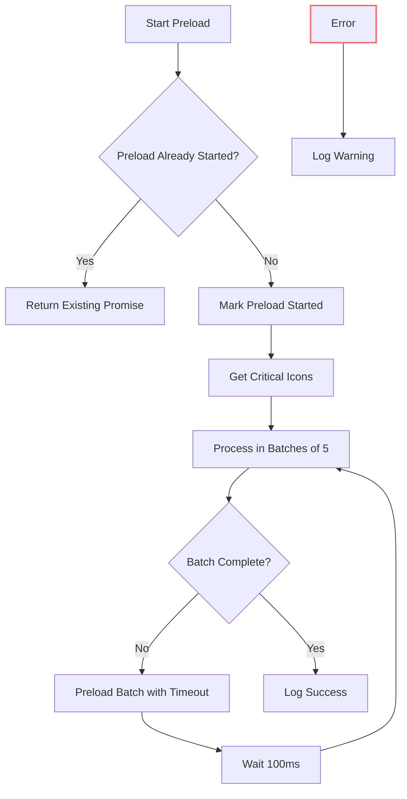

# Build & Deployment Pipeline

<cite>
**Referenced Files in This Document**   
- [vite.config.ts](file://vite.config.ts)
- [vercel.json](file://vercel.json)
- [dev-server.js](file://dev-server.js)
- [package.json](file://package.json)
- [services/iconPreload.ts](file://services/iconPreload.ts)
- [services/iconCache.ts](file://services/iconCache.ts)
- [constants.tsx](file://constants.tsx)
</cite>

## Table of Contents
1. [Vite Build Configuration](#vite-build-configuration)
2. [Deployment Configuration on Vercel](#deployment-configuration-on-vercel)
3. [Development Workflow](#development-workflow)
4. [Optimization Techniques](#optimization-techniques)
5. [Environment Management](#environment-management)
6. [Build Caching and Deployment Triggers](#build-caching-and-deployment-triggers)
7. [Troubleshooting Common Issues](#troubleshooting-common-issues)
8. [Performance Monitoring and Deployment Verification](#performance-monitoring-and-deployment-verification)

## Vite Build Configuration

The Vite build configuration is defined in `vite.config.ts` and sets up both development and production environments. The configuration includes the React plugin, specifies the public directory as `public`, and configures the build output to generate files in the `dist` directory with assets stored in an `assets` subdirectory. During the build process, the contents of the `public` directory are copied to the output directory to ensure static assets are properly included.

In development mode, Vite uses a proxy configuration to forward API requests from `/api` to `http://localhost:3001`, enabling seamless integration with the local development server for backend services. This setup allows frontend developers to work independently while maintaining connectivity to backend APIs during development.

**Section sources**
- [vite.config.ts](file://vite.config.ts#L1-L22)

## Deployment Configuration on Vercel

Deployment is configured through `vercel.json`, which specifies the framework as Vite and defines key deployment parameters. The build command is set to `npm run build`, and the output directory is configured as `dist`, aligning with Vite's default build output. Dependency installation uses `npm ci` for consistent and reproducible builds.

The configuration includes rewrite rules that direct all routes to `index.html`, enabling client-side routing for the SPA. Permanent redirects are defined for legacy paths such as `/home` to root and for domain normalization. Security headers are enforced across all routes, including `X-Frame-Options: DENY`, `X-Content-Type-Options: nosniff`, and `Referrer-Policy: strict-origin-when-cross-origin`. Additionally, CORS headers are applied to API routes to allow cross-origin requests with specified methods and headers.

**Section sources**
- [vercel.json](file://vercel.json#L1-L60)

## Development Workflow

The development workflow is orchestrated through npm scripts defined in `package.json`. The `dev` script launches the Vite development server, while `dev:api` starts the Express-based API server defined in `dev-server.js`. For full-stack development, the `dev:full` script uses `concurrently` to run both servers simultaneously, enabling integrated frontend and backend development.

The API server in `dev-server.js` handles proxy requests for the Brave Search API, validating the presence of the `BRAVE_API_KEY` environment variable and forwarding requests with proper authentication headers. It also provides a health check endpoint at `/api/health` to verify server status and environment configuration. CORS is configured to allow requests from common Vite development ports (`localhost:3000` and `localhost:5173`).

**Section sources**
- [package.json](file://package.json#L1-L45)
- [dev-server.js](file://dev-server.js#L1-L80)

## Optimization Techniques

The application implements several optimization techniques to enhance performance and user experience. The `iconPreload.ts` service preloads critical icons that appear above the fold, reducing layout shifts and improving perceived performance. It identifies icons from social links, partner logos, and trusted client logos defined in `constants.tsx`, then preloads them in batches of five with timeouts and delays to prevent blocking the main thread.

Icons are cached using `iconCache.ts`, which stores URLs with a 24-hour validity period and validates image URLs before caching. The cache is periodically cleaned every hour to remove expired entries. Preloading is initiated during the preloader phase to ensure icons begin loading early in the page lifecycle. This strategy significantly improves First Contentful Paint (FCP) and Largest Contentful Paint (LCP) metrics by ensuring critical visual elements are available immediately.

**Diagram sources**
- [services/iconPreload.ts](file://services/iconPreload.ts#L10-L160)
- [services/iconCache.ts](file://services/iconCache.ts#L1-L150)

**Section sources**
- [services/iconPreload.ts](file://services/iconPreload.ts#L1-L166)
- [services/iconCache.ts](file://services/iconCache.ts#L1-L150)
- [constants.tsx](file://constants.tsx#L1-L799)

## Environment Management

Environment variables are managed using `dotenv` in the development server, loading configuration from `.env.local`. The `BRAVE_API_KEY` is required for the Brave Search API integration and is validated at runtime. If missing, the server returns a 500 error with a descriptive message. Environment status is displayed in the server startup logs, showing whether critical variables are loaded or missing.

In production, environment variables are expected to be configured through Vercel's environment management interface, ensuring secure handling of sensitive credentials. The development server explicitly checks for the presence of required environment variables to prevent runtime failures during development.

**Section sources**
- [dev-server.js](file://dev-server.js#L5-L10)

## Build Caching and Deployment Triggers

The build process leverages Vite's built-in caching mechanisms for faster rebuilds during development. Production builds are triggered through Vercel's deployment pipeline, which uses the `buildCommand` specified in `vercel.json`. The use of `npm ci` ensures dependencies are installed from `package-lock.json` for consistent builds.

Vercel automatically caches `node_modules` between builds to improve performance, and the deployment process respects the `engines` field in `package.json`, which specifies Node.js version 22.4.1 and npm 10.8.1. This ensures environment consistency between development and production.

**Section sources**
- [package.json](file://package.json#L40-L45)
- [vercel.json](file://vercel.json#L3-L5)

## Troubleshooting Common Issues

Common build and deployment issues include missing environment variables, API proxy failures, and asset loading problems. If the `BRAVE_API_KEY` is missing, the development API server will fail with a 500 error; ensure `.env.local` is properly configured. Proxy issues may occur if the API server is not running; verify that `npm run dev:api` is active when using the frontend development server.

Build failures can result from TypeScript errors, as the build script runs `tsc` before `vite build`. Check for type errors in the codebase if the build fails. Deployment issues on Vercel may stem from incorrect output directory configuration; confirm that `vercel.json` specifies `dist` as the output directory.

For icon loading issues, check the preload service logs for timeout warnings and verify that domains in `constants.tsx` match those expected by the Brandfetch API. Cache issues can be resolved by clearing the browser cache or waiting for the 24-hour cache duration to expire.

**Section sources**
- [dev-server.js](file://dev-server.js#L25-L40)
- [vite.config.ts](file://vite.config.ts#L1-L22)
- [services/iconPreload.ts](file://services/iconPreload.ts#L1-L166)

## Performance Monitoring and Deployment Verification

Performance can be monitored using browser developer tools, focusing on Lighthouse metrics such as FCP, LCP, and Time to Interactive (TTI). The preloading strategy for icons directly impacts these metrics, and adjustments to batch size or timeout values in `iconPreload.ts` can be made based on performance testing.

Successful deployments to Vercel can be verified through the Vercel dashboard, which provides build logs and deployment status. The application's health check endpoint at `/api/health` returns server status and environment configuration, allowing verification of API functionality. Additionally, the presence of security headers in the response can be confirmed using browser developer tools to ensure proper deployment configuration.

**Section sources**
- [dev-server.js](file://dev-server.js#L70-L75)
- [vercel.json](file://vercel.json#L40-L55)