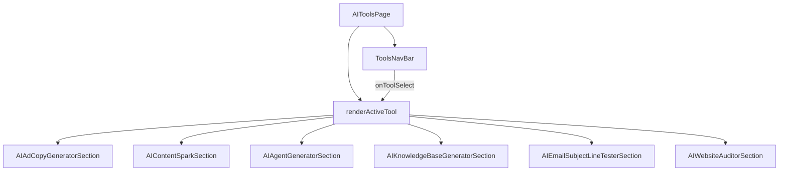

# Component Architecture

<cite>
**Referenced Files in This Document**   
- [App.tsx](file://App.tsx)
- [components/Header.tsx](file://components/Header.tsx)
- [components/HeroSection.tsx](file://components/HeroSection.tsx)
- [components/Footer.tsx](file://components/Footer.tsx)
- [components/AILaunchpadSection.tsx](file://components/AILaunchpadSection.tsx)
- [components/AIToolsPage.tsx](file://components/AIToolsPage.tsx)
- [components/AIAdCopyGeneratorSection.tsx](file://components/AIAdCopyGeneratorSection.tsx)
- [components/AIContentSparkSection.tsx](file://components/AIContentSparkSection.tsx)
- [components/AIAgentGeneratorSection.tsx](file://components/AIAgentGeneratorSection.tsx)
- [components/AIKnowledgeBaseGeneratorSection.tsx](file://components/AIKnowledgeBaseGeneratorSection.tsx)
- [components/AIEmailSubjectLineTesterSection.tsx](file://components/AIEmailSubjectLineTesterSection.tsx)
- [components/AIWebsiteAuditorSection.tsx](file://components/AIWebsiteAuditorSection.tsx)
</cite>

## Table of Contents
1. [Introduction](#introduction)
2. [Root Component: App.tsx](#root-component-apptsx)
3. [Layout Components](#layout-components)
4. [Component Composition Patterns](#component-composition-patterns)
5. [Functional Components and React Hooks](#functional-components-and-react-hooks)
6. [Accessibility and Responsive Design](#accessibility-and-responsive-design)
7. [Best Practices for Component Creation](#best-practices-for-component-creation)
8. [Conclusion](#conclusion)

## Introduction
This document provides a comprehensive analysis of the component-based architecture of the Synaptix Studio website application. The design philosophy centers on breaking down the user interface into reusable, self-contained React components, which are organized under the `/components` directory. This modular approach enhances maintainability, promotes code reuse, and allows for a clear separation of concerns. The `App.tsx` file serves as the root component, managing routing and global state, while key layout components such as `Header`, `Footer`, and `HeroSection` define the overall structure of the application. The document will explore the structure, responsibilities, and interaction patterns of these components, providing a detailed understanding of the application's architecture.

## Root Component: App.tsx
The `App.tsx` file acts as the central orchestrator of the entire application, serving as the root component that manages the application's state, routing, and rendering of major UI sections. It imports and composes all primary layout and feature components, including `Header`, `HeroSection`, `ServicesSection`, `Footer`, and specialized pages like `AIToolsPage` and `BlogPage`. The component uses React's `useState` and `useEffect` hooks to manage a variety of state variables, such as the current navigation path, theme preference (light/dark mode), and authentication status for the admin dashboard. A custom `getRoute` function parses the URL hash to determine the active page, while the `navigate` function updates the hash to trigger navigation. The component also handles side effects like fetching blog posts from a Supabase database, tracking page views for analytics, and managing a dynamic meta tag system for SEO. The `renderContent` function acts as a router, conditionally rendering the appropriate component based on the current path, demonstrating a clean and centralized control flow for the application's UI.

**Section sources**
- [App.tsx](file://App.tsx#L1-L595)

## Layout Components
The application's visual structure is defined by a set of key layout components that provide a consistent user experience across different pages. These components are designed to be self-contained, managing their own state and styling while accepting props to customize their behavior.

### Header
The `Header` component is a complex navigation bar that is fixed at the top of the viewport. It manages multiple states, including the visibility of mobile and desktop dropdown menus for "AI Tools" and "Resources." The component uses `useState` to track the open/closed state of these menus and `useRef` to create references for detecting clicks outside the menu to close it. It renders a logo, a set of primary navigation links, a prominent "Free Business Tools" button with its own dropdown, a theme toggle button, and a mobile menu button. The theme toggle button uses a callback function passed from `App.tsx` to update the global theme state. The component is highly interactive, with event handlers for clicks and mousedown events to manage menu state and navigation.

**Section sources**
- [components/Header.tsx](file://components/Header.tsx#L1-L246)

### HeroSection
The `HeroSection` is the primary landing area of the homepage, designed to capture user attention and convey the core value proposition. It is composed of a `RightColumnContent` sub-component that manages several dynamic elements. The main section uses `useMemo` to define an array of rotating taglines and `useEffect` to animate them character-by-character. It also manages a newsletter subscription form with state for the email input, submission status, and error messages. The `RightColumnContent` component features a rotating carousel of "floating services" and client logos, both implemented with `useEffect` timers to cycle through items. It also includes a live counter for leads captured and a call-to-action button that opens a Calendly modal. This component exemplifies the use of composition and state management for creating a rich, interactive user experience.

**Section sources**
- [components/HeroSection.tsx](file://components/HeroSection.tsx#L1-L436)

### Footer
The `Footer` component provides a consistent footer across the site, containing the brand logo, a newsletter subscription form, and links organized into three columns: "Quick Links," "Resources," and "Get in Touch." It is a simpler component compared to the header, primarily managing the state of its own newsletter form (email input, submission status, loading state, and errors). It receives the `navigate` function as a prop to handle internal link clicks and uses the `theme` prop to conditionally render the light or dark version of the logo. The component's structure is defined by a grid layout, and it includes a bottom bar with copyright information and social media links.

**Section sources**
- [components/Footer.tsx](file://components/Footer.tsx#L1-L136)

## Component Composition Patterns
The application extensively uses component composition to build complex UIs from simpler, reusable parts. This pattern is evident throughout the codebase, from the high-level structure of `App.tsx` down to the individual sections.

### AIToolsPage Composition
The `AIToolsPage` component is a prime example of dynamic composition. It acts as a container for a suite of AI tools, using a `ToolsNavBar` component for navigation and a `renderActiveTool` function to conditionally render the active tool section based on the URL hash. The component manages its own state (`activeTool`) to keep track of the currently selected tool. When a user selects a tool from the navigation bar, the `handleToolSelect` function updates the state and navigates to the corresponding URL. The `renderActiveTool` function then uses a `switch` statement to return the appropriate component, such as `AIAdCopyGeneratorSection`, `AIContentSparkSection`, or `AIAgentGeneratorSection`. This pattern allows for a single, cohesive page that can display a wide variety of functionality without requiring a full page reload.

**Diagram sources**
- [components/AIToolsPage.tsx](file://components/AIToolsPage.tsx#L1-L108)

### AI Tool Section Composition
Each AI tool section follows a similar composition pattern, combining a user input form with a results display area. For instance, the `AIAdCopyGeneratorSection` composes an `AdCard` component to display each generated ad variation. The `AIContentSparkSection` uses several helper components like `EditableField`, `HookVariations`, `ImageIdea`, and `PlatformAdaptations` to organize its results. The `AIAgentGeneratorSection` is the most complex, composing a live demo (either a `ChatbotDemo` or `VoiceAgentDemo`), a `BlueprintDisplay` for the agent's system prompt, and a `Live Training` section. This hierarchical composition allows each tool to have a unique interface while sharing a common underlying structure.

## Functional Components and React Hooks
All components in the application are implemented as functional components, leveraging React hooks for state management and side effects. This modern React pattern promotes cleaner, more readable code.

### State Management with useState
The `useState` hook is used ubiquitously to manage component state. Examples include:
- `App.tsx`: Manages `loading`, `location`, `blogPosts`, `theme`, and `currentTestimonialIndex`.
- `Header.tsx`: Manages `isMenuOpen`, `isToolsMenuOpen`, and `isResourcesMenuOpen`.
- `HeroSection.tsx`: Manages `email`, `submitted`, `loading`, `error`, and `currentServiceIndex`.
- `AIAdCopyGeneratorSection.tsx`: Manages form inputs (`productName`, `targetAudience`, `keyBenefits`, `adPlatform`) and the `results` array.

### Side Effects with useEffect
The `useEffect` hook is used to handle side effects such as data fetching, event listeners, and DOM manipulation.
- `App.tsx`: Fetches blog posts on mount, sets up a hashchange listener for navigation, and updates meta tags based on the current route.
- `Header.tsx`: Sets up a mousedown event listener to close menus when clicking outside, and manages the document's overflow style to prevent scrolling when the mobile menu is open.
- `HeroSection.tsx`: Sets up timers to rotate services, client logos, and newsletter button text.

### Custom Hooks
The application uses custom hooks to encapsulate reusable logic. The `useOnScreen` hook, imported from `./hooks/useOnScreen`, is used in multiple components (`FAQSection`, `HeroSection`, `HowItWorksSection`) to detect when an element becomes visible in the viewport, enabling animations and lazy loading. This demonstrates a best practice of extracting complex logic into reusable hooks.

## Accessibility and Responsive Design
The application demonstrates a strong commitment to accessibility and responsive design, ensuring a good user experience across different devices and for users with disabilities.

### Accessibility (a11y)
The components are built with accessibility in mind, using semantic HTML and ARIA attributes.
- **Semantic Structure**: Components use appropriate HTML elements like `<header>`, `<nav>`, `<section>`, and `<footer>`.
- **ARIA Attributes**: Interactive elements like buttons and dropdowns use `aria-label`, `aria-expanded`, `aria-haspopup`, and `aria-controls` to provide context for screen readers. For example, the "AI Tools" dropdown button has `aria-expanded` to indicate its open/closed state.
- **Keyboard Navigation**: The `Header` component handles the `Escape` key to close menus and uses `tabindex` implicitly through semantic elements.
- **Focus Management**: The `Header` component uses `ref` to manage focus for the mobile menu button and menu itself.

### Responsive Design with Tailwind CSS
The application uses Tailwind CSS for a mobile-first, responsive design.
- **Grid and Flexbox**: The layout is built using Tailwind's `grid` and `flex` utilities. For example, `HeroSection` uses `grid-cols-1 md:grid-cols-2 lg:grid-cols-5` to change its layout from a single column on mobile to five columns on large screens.
- **Conditional Styling**: Classes are conditionally applied based on state and screen size. For instance, the "Free Business Tools" button in the `Header` displays "AI Tools" on small screens (`sm:hidden`) and "Free Business Tools" on larger screens (`hidden sm:inline`).
- **Viewport Units**: The `HeroSection` uses `min-h-screen` to ensure it takes up the full viewport height, and `pt-28 sm:pt-24` to adjust padding based on screen size.

## Best Practices for Component Creation
Based on the existing codebase, the following best practices should be followed when creating new components:

1.  **Use Functional Components and Hooks**: Always use functional components with `useState`, `useEffect`, and other hooks instead of class components.
2.  **Single Responsibility Principle**: Each component should have a single, well-defined purpose. If a component becomes too large, break it down into smaller sub-components.
3.  **Leverage Composition**: Build complex UIs by composing smaller, reusable components. Use props to pass data and callbacks down the component tree.
4.  **Manage State Locally**: Keep state as close to the components that need it as possible. Use lifting state up only when necessary for sharing state between sibling components.
5.  **Prioritize Accessibility**: Use semantic HTML, provide descriptive labels, and ensure the component is fully navigable with a keyboard.
6.  **Design for Responsiveness**: Use Tailwind CSS's responsive prefixes (`sm:`, `md:`, `lg:`, `xl:`) to create layouts that adapt to different screen sizes.
7.  **Use TypeScript**: Define clear `interface` types for component props to ensure type safety and improve code documentation.
8.  **Handle Side Effects Carefully**: Use `useEffect` for side effects and always include a cleanup function to prevent memory leaks, especially for event listeners and timers.

## Conclusion
The Synaptix Studio website application exhibits a well-structured, component-based architecture that adheres to modern React best practices. The design philosophy of breaking the UI into reusable, self-contained components is evident throughout the codebase, from the root `App.tsx` component down to the smallest UI elements. The use of functional components, React hooks, and a mobile-first approach with Tailwind CSS results in a maintainable, accessible, and responsive application. By following the established patterns of composition, state management, and accessibility, new components can be added to the application in a way that ensures consistency and quality.