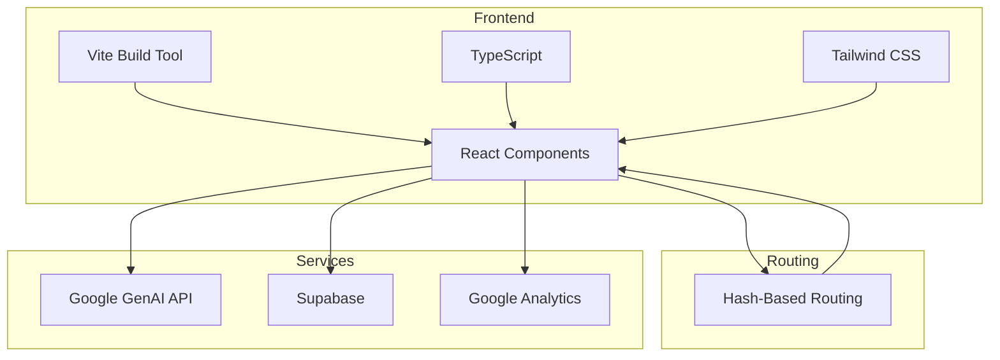
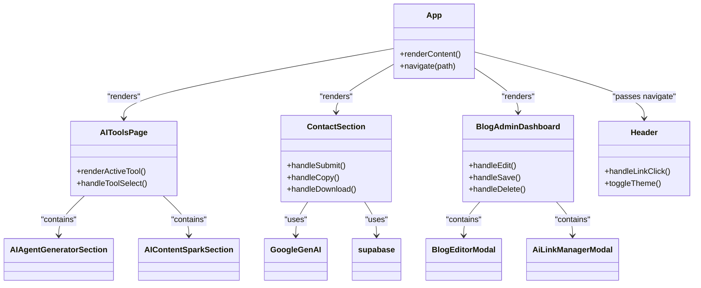
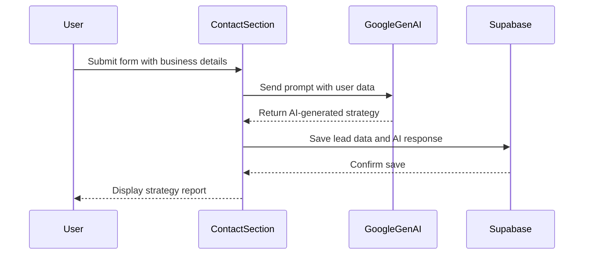

# Project Overview

<cite>
**Referenced Files in This Document**   
- [App.tsx](file://App.tsx)
- [AIToolsPage.tsx](file://components/AIToolsPage.tsx)
- [ContactSection.tsx](file://components/ContactSection.tsx)
- [BlogAdminDashboard.tsx](file://components/admin/BlogAdminDashboard.tsx)
- [supabase.ts](file://services/supabase.ts)
- [analytics.ts](file://services/analytics.ts)
- [vite.config.ts](file://vite.config.ts)
- [index.html](file://index.html)
- [constants.tsx](file://constants.tsx)
</cite>

## Table of Contents
1. [Introduction](#introduction)
2. [Core Features](#core-features)
3. [High-Level Architecture](#high-level-architecture)
4. [Component Relationships](#component-relationships)
5. [Implementation Details](#implementation-details)
6. [User Workflow and System Interaction](#user-workflow-and-system-interaction)
7. [Extending and Customizing the System](#extending-and-customizing-the-system)
8. [Conclusion](#conclusion)

## Introduction
The synaptix-studio-website-app is a marketing and lead-generation platform developed for Synaptix Studio, an AI automation agency. The application serves as a digital showcase for the agency's capabilities, offering potential clients interactive tools to experience AI-driven solutions firsthand. Its primary purpose is to generate qualified leads by providing immediate value through free AI tools, capturing user information, and guiding prospects toward personalized consultations. The platform combines a user-friendly interface with sophisticated backend integrations to deliver a seamless experience that highlights the agency's expertise in intelligent automation.

**Section sources**
- [App.tsx](file://App.tsx#L1-L594)
- [README.md](file://README.md#L1-L20)

## Core Features
The application is built around three core features designed to engage users and convert them into leads. The first is the AI tools suite, which provides a collection of free, interactive utilities such as the AI Agent Generator, Content Strategist, and Website Auditor. These tools allow users to input their business details and receive instant, AI-generated insights, demonstrating the agency's technical prowess. The second key feature is the blog content management system, which includes a comprehensive admin dashboard (BlogAdminDashboard) for creating, editing, and optimizing blog posts. This system leverages AI to generate content, suggest SEO strategies, and analyze performance, ensuring a steady stream of high-quality, lead-generating content. The third major feature is the interactive lead capture mechanism, centered around the ContactSection. This component collects user information and business goals, then uses AI to generate a personalized strategy report, which is delivered instantly to the user, creating a powerful conversion moment.

**Section sources**
- [AIToolsPage.tsx](file://components/AIToolsPage.tsx#L21-L105)
- [ContactSection.tsx](file://components/ContactSection.tsx#L12-L334)
- [BlogAdminDashboard.tsx](file://components/admin/BlogAdminDashboard.tsx#L715-L938)

## High-Level Architecture
The synaptix-studio-website-app is a React-based single-page application (SPA) built with Vite as the build tool and TypeScript for type safety. The architecture follows a component-based design, where the entire user interface is composed of reusable React components. Routing is implemented using a hash-based strategy, which allows for client-side navigation without requiring server-side configuration. The application's state is managed locally within components using React's useState and useEffect hooks, with navigation handled through a custom navigate function that manipulates the URL hash. The build process is configured in vite.config.ts, which sets the public directory and output paths. The application is served from a single index.html file, which includes all necessary meta tags, scripts for Google Analytics and Calendly, and a Tailwind CSS CDN for styling.

**Diagram sources **
- [vite.config.ts](file://vite.config.ts#L1-L22)
- [index.html](file://index.html#L1-L395)
- [App.tsx](file://App.tsx#L1-L594)

**Section sources**
- [vite.config.ts](file://vite.config.ts#L1-L22)
- [index.html](file://index.html#L1-L395)
- [App.tsx](file://App.tsx#L1-L594)

## Component Relationships
The application's components are organized in a hierarchical structure, with the App component serving as the root. The App component orchestrates the rendering of major sections such as the Header, HeroSection, ServicesSection, and ContactSection based on the current route. The AIToolsPage component acts as a container for the suite of AI tools, dynamically rendering different tool sections (e.g., AIAgentGeneratorSection, AIContentSparkSection) based on the URL hash. The ContactSection is a self-contained component that handles form submission, AI interaction, and result display. The BlogAdminDashboard is a specialized component for content management, which is conditionally rendered when an admin is authenticated. These components are interconnected through props, with the App component passing a navigate function to child components to enable consistent routing. The component composition is defined in App.tsx, where the MainContent component is used to group and render the primary user-facing pages.

**Diagram sources **
- [App.tsx](file://App.tsx#L1-L594)
- [AIToolsPage.tsx](file://components/AIToolsPage.tsx#L21-L105)
- [ContactSection.tsx](file://components/ContactSection.tsx#L12-L334)
- [BlogAdminDashboard.tsx](file://components/admin/BlogAdminDashboard.tsx#L715-L938)

**Section sources**
- [App.tsx](file://App.tsx#L1-L594)
- [AIToolsPage.tsx](file://components/AIToolsPage.tsx#L21-L105)
- [ContactSection.tsx](file://components/ContactSection.tsx#L12-L334)
- [BlogAdminDashboard.tsx](file://components/admin/BlogAdminDashboard.tsx#L715-L938)

## Implementation Details
The application implements several key technical patterns to achieve its functionality. Hash-based routing is managed within the App component, which listens for hashchange events and updates the application state accordingly. This allows for deep linking to specific tools or sections without a full page reload. Component composition is used extensively, with the AIToolsPage dynamically rendering different tool sections based on the active hash. The application integrates with external services through dedicated modules: the Google GenAI API is used for AI-powered content generation and strategy reports, Supabase provides a backend for data persistence (e.g., saving lead information and blog posts), and Google Analytics tracks user interactions. The ContactSection component demonstrates a complex interaction flow, where a form submission triggers an AI request, the response is saved to Supabase, and the result is displayed to the user with options to copy or download the report. The application also includes a dark mode toggle, which is persisted in localStorage and applied by adding a 'dark' class to the document element.

**Diagram sources **
- [ContactSection.tsx](file://components/ContactSection.tsx#L12-L334)
- [supabase.ts](file://services/supabase.ts#L1-L277)
- [analytics.ts](file://services/analytics.ts#L1-L39)

**Section sources**
- [App.tsx](file://App.tsx#L1-L594)
- [ContactSection.tsx](file://components/ContactSection.tsx#L12-L334)
- [supabase.ts](file://services/supabase.ts#L1-L277)
- [analytics.ts](file://services/analytics.ts#L1-L39)

## User Workflow and System Interaction
A typical user journey begins on the homepage, where they are introduced to the agency's services. The user may navigate to the AI tools section, where they can select a specific tool like the AI Agent Generator. Upon selecting a tool, the URL hash changes, and the AIToolsPage component renders the corresponding tool section. The user interacts with the tool, which may involve filling out a form or providing input. For the lead capture workflow, the user fills out the ContactSection form with their name, email, and business goals. Upon submission, the application sends a prompt to the Google GenAI API, which analyzes the input and generates a custom AI strategy report. This report is then saved to the Supabase database, and the user is presented with the results on the same page. The user can then choose to copy the report to their clipboard, download it as a PDF, or book a free demo call. This seamless interaction demonstrates the power of AI automation and creates a compelling reason for the user to engage further with the agency.

**Section sources**
- [App.tsx](file://App.tsx#L1-L594)
- [ContactSection.tsx](file://components/ContactSection.tsx#L12-L334)
- [AIToolsPage.tsx](file://components/AIToolsPage.tsx#L21-L105)

## Extending and Customizing the System
Developers can extend and customize the system by adding new components and integrating them into the existing architecture. To add a new AI tool, a developer would create a new component (e.g., NewToolSection.tsx) and import it into the AIToolsPage. The new tool would then be added to the renderActiveTool function's switch statement, with a unique hash value as the case. The navigation system would automatically handle the routing to the new tool. To add a new page, a developer would update the renderContent function in the App component to include a new route and its corresponding component. The application's modular design, with its clear separation of concerns and use of TypeScript, makes it easy to maintain and extend. Developers can also customize the look and feel by modifying the Tailwind CSS classes or adding new styles in the index.html file. The use of environment variables (e.g., VITE_GEMINI_API_KEY) allows for easy configuration of external service credentials.

**Section sources**
- [App.tsx](file://App.tsx#L1-L594)
- [AIToolsPage.tsx](file://components/AIToolsPage.tsx#L21-L105)
- [constants.tsx](file://constants.tsx#L1-L799)

## Conclusion
The synaptix-studio-website-app is a sophisticated marketing platform that effectively showcases the capabilities of an AI automation agency. By combining a modern React frontend with powerful AI integrations, it provides a compelling user experience that drives lead generation. The application's architecture is well-structured, with a clear separation of components and a robust system for handling navigation and state. Its core features—the AI tools suite, blog content management, and interactive lead capture—work together to create a cohesive and engaging user journey. The use of hash-based routing, component composition, and external service integrations demonstrates a thoughtful approach to web development that prioritizes user experience and business goals. This platform serves as an excellent example of how AI can be leveraged to create value for both a business and its potential clients.