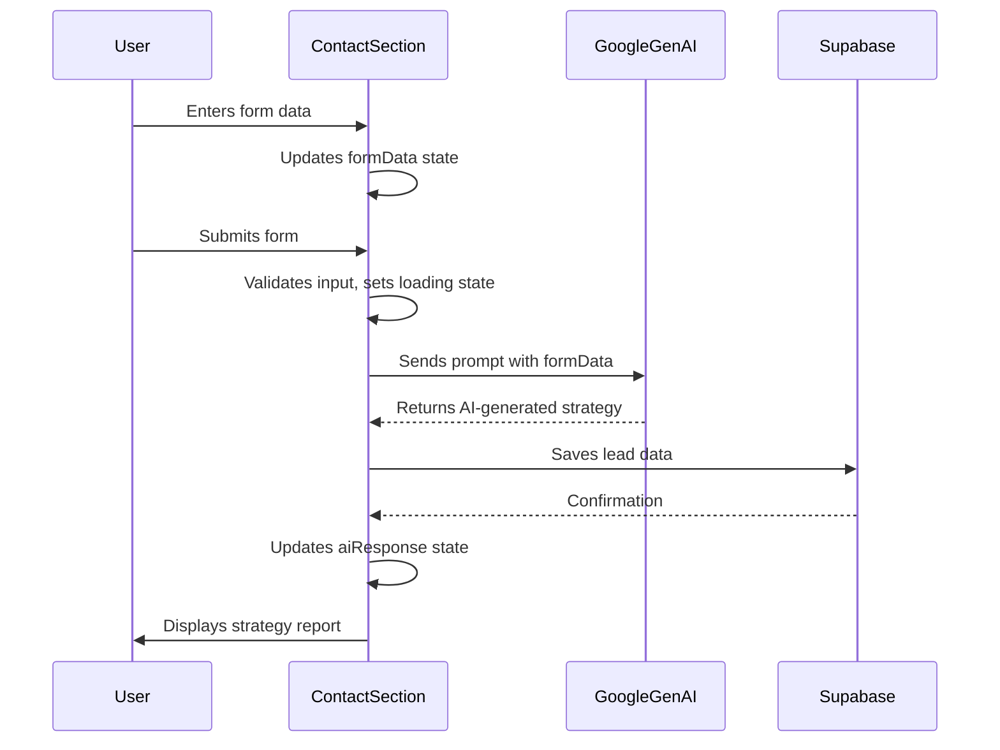
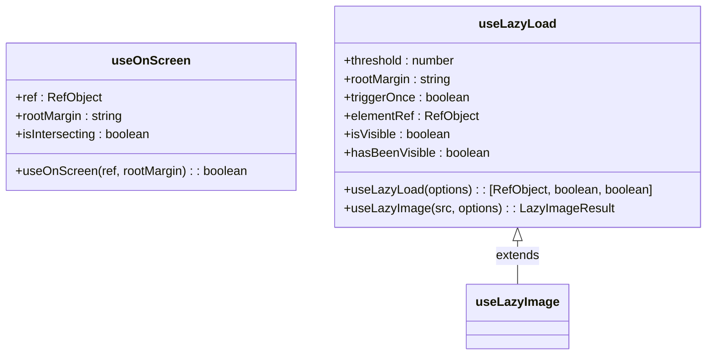

# State Management

<cite>
**Referenced Files in This Document**   
- [App.tsx](file://App.tsx)
- [ContactSection.tsx](file://components/ContactSection.tsx)
- [useOnScreen.ts](file://hooks/useOnScreen.ts)
- [useLazyLoad.ts](file://hooks/useLazyLoad.ts)
</cite>

## Table of Contents
1. [Introduction](#introduction)
2. [Global State Management in App.tsx](#global-state-management-in-apptsx)
3. [Local Component State with useState](#local-component-state-with-usestate)
4. [State Flow Between Components](#state-flow-between-components)
5. [Custom Hooks for State Management](#custom-hooks-for-state-management)
6. [State Persistence Patterns](#state-persistence-patterns)
7. [Re-render Triggers and Optimization](#re-render-triggers-and-optimization)
8. [Best Practices and Scalability](#best-practices-and-scalability)
9. [Troubleshooting Common State Issues](#troubleshooting-common-state-issues)

## Introduction
This document provides a comprehensive analysis of the state management patterns implemented in the Synaptix Studio website application. The application employs a hybrid approach combining React's built-in hooks for local state management with centralized global state handling in the App component. The system effectively manages UI state, user preferences, form data, and asynchronous operations while maintaining performance through custom hooks for lazy loading and visibility detection. This documentation details the implementation, flow, and optimization strategies for state management across the application.

## Global State Management in App.tsx
The App.tsx component serves as the central state management hub for the application, managing several global state variables that affect the entire user experience. The component uses useState hooks to manage navigation state, theme preferences, authentication status, and content visibility.

Key global state variables include:
- **Theme state**: Manages light/dark mode preference with persistence to localStorage
- **Navigation state**: Tracks current route and hash for SPA navigation
- **Authentication state**: Handles admin authentication flow through keyboard sequence detection
- **Content state**: Manages blog post data, testimonial rotation, and modal visibility

The theme state is particularly well-implemented with a robust initialization function that safely handles server-side rendering and localStorage access. The theme preference is persisted across sessions and synchronized with both the DOM (via the 'dark' class) and localStorage. The navigation system uses hash-based routing with smooth scrolling to anchor points, while the admin authentication system implements a unique keyboard sequence detection mechanism that triggers the login modal.

```mermaid
classDiagram
class App {
+loading : boolean
+location : {pathname : string, hash : string}
+blogPosts : BlogPost[]
+blogLoadingError : string | null
+showAdminLogin : boolean
+isAdminAuthenticated : boolean
+currentTestimonialIndex : number
+showCalendlyModal : boolean
+theme : 'light' | 'dark'
-getInitialTheme() : 'light' | 'dark'
+toggleTheme() : void
+openCalendlyModal() : void
+closeCalendlyModal() : void
+navigate(path : string) : void
}
```

**Diagram sources**
- [App.tsx](file://App.tsx#L205-L224)

**Section sources**
- [App.tsx](file://App.tsx#L198-L591)

## Local Component State with useState
Components throughout the application utilize React's useState hook for managing local state, particularly for form handling and UI interactions. The ContactSection component provides a comprehensive example of local state management for form data collection and processing.

The ContactSection maintains several state variables:
- **formData**: An object containing form fields (name, email, websiteUrl, businessNeeds)
- **loading**: Boolean flag to manage submission state and UI feedback
- **error**: String state for displaying form validation or submission errors
- **aiResponse**: Stores the AI-generated strategy response
- **copied**: Tracks clipboard copy status for user feedback

The form implements controlled components with handleChange functions that use functional updates to ensure state consistency. The component also manages focus states and validation through conditional rendering of error messages. The loading state triggers a dynamic loader component, providing visual feedback during AI processing, while the aiResponse state controls the visibility of the generated strategy report.

**Section sources**
- [ContactSection.tsx](file://components/ContactSection.tsx#L12-L397)

## State Flow Between Components
The application demonstrates effective state flow patterns between components, particularly in the form data processing workflow within ContactSection. Form data flows from user input through local state management to external service integration and back to UI updates.

The state flow follows this pattern:
1. User input updates local formData state via handleChange
2. Form submission validates data and sets loading state
3. Validated data is sent to external AI service (Google GenAI)
4. AI response is stored in aiResponse state
5. Response triggers UI update and analytics tracking
6. User interactions with the response (copy, download) update additional state variables

The component passes state and callbacks to child components through props, maintaining a clear unidirectional data flow. The MainContent component receives state and callbacks from App.tsx and distributes them to various sections, creating a well-structured state hierarchy. The testimonial system demonstrates lifted state management, with the current index maintained in App.tsx and passed down to TestimonialsSection.



**Diagram sources**
- [ContactSection.tsx](file://components/ContactSection.tsx#L12-L397)
- [App.tsx](file://App.tsx#L198-L591)

## Custom Hooks for State Management
The application implements two custom hooks in the /hooks directory that enhance state management capabilities: useOnScreen for intersection detection and useLazyLoad for performance optimization.

The useOnScreen hook uses the Intersection Observer API to detect when an element enters the viewport, triggering state changes for animation and visibility. It includes a fallback timer to ensure content visibility even if the observer fails, demonstrating robust error handling. The hook returns a boolean indicating intersection status and accepts configurable rootMargin parameters.

The useLazyLoad hook provides more advanced functionality with support for lazy loading images and other content. It returns a tuple containing a ref, visibility status, and a flag indicating if the element has ever been visible. The hook includes browser compatibility checks and supports configuration options for threshold, rootMargin, and triggerOnce behavior. The companion useLazyImage hook extends this functionality with image preloading and error handling.



**Diagram sources**
- [useOnScreen.ts](file://hooks/useOnScreen.ts#L1-L43)
- [useLazyLoad.ts](file://hooks/useLazyLoad.ts#L1-L114)

**Section sources**
- [useOnScreen.ts](file://hooks/useOnScreen.ts#L1-L43)
- [useLazyLoad.ts](file://hooks/useLazyLoad.ts#L1-L114)

## State Persistence Patterns
The application implements state persistence primarily through localStorage for user preferences. The theme state is the primary example of persistent state, with the getInitialTheme function reading from localStorage on initialization and the useEffect hook writing changes back to localStorage.

The persistence mechanism includes error handling for localStorage access, ensuring the application remains functional even if localStorage is unavailable. The theme preference is synchronized with both the application state and the DOM class system, providing a seamless user experience across sessions.

While the application does not implement complex state persistence for form data or other transient states, it does persist certain analytics and tracking information through external services. The combination of localStorage for user preferences and external databases for application data represents a balanced approach to state persistence.

**Section sources**
- [App.tsx](file://App.tsx#L162-L203)

## Re-render Triggers and Optimization
The application employs several strategies to manage re-renders and optimize performance. The use of useCallback for event handlers like toggleTheme, openCalendlyModal, and navigate prevents unnecessary re-renders of child components by ensuring stable function references.

The ContactSection component demonstrates effective dependency management in its useEffect hooks, with precise dependency arrays that prevent infinite loops and unnecessary executions. The form's handleChange function uses functional updates to avoid stale closures, ensuring consistent state updates.

For performance optimization, the custom hooks useLazyLoad and useOnScreen implement intersection observation to defer rendering of off-screen content. This reduces initial load time and memory usage by only rendering content when it enters the viewport. The useLazyLoad hook also supports triggerOnce behavior, preventing repeated observations after initial visibility.

The application could further optimize re-renders by implementing React.memo for components with expensive renders or by using useMemo for complex computed values, but the current implementation provides adequate performance for its use case.

**Section sources**
- [App.tsx](file://App.tsx#L223-L260)
- [ContactSection.tsx](file://components/ContactSection.tsx#L12-L397)

## Best Practices and Scalability
The application follows several React state management best practices while also revealing opportunities for improvement as it scales. The separation of concerns between global and local state is well-implemented, with App.tsx managing application-wide state and individual components handling their specific needs.

The use of custom hooks promotes reusability and encapsulation, making state logic easier to maintain and test. The error boundaries and fallback mechanisms demonstrate robust error handling, particularly in the useOnScreen hook's timer fallback.

However, as the application grows, the centralized state in App.tsx may become unwieldy. Consideration should be given to introducing a global state management library like Redux Toolkit or Zustand to manage complex state interactions. The current prop drilling pattern, while functional for the current size, could benefit from context providers for deeply nested components.

The theme management system could be enhanced with a ThemeContext to avoid prop drilling of toggleTheme and theme props to multiple components. Similarly, the navigation system might benefit from a dedicated routing context to simplify state management across the application.

## Troubleshooting Common State Issues
Common state-related issues in this application typically involve asynchronous state updates, form validation, and persistence failures. When debugging state issues, consider the following:

1. **Form submission failures**: Check that all required fields are properly validated and that the loading state is correctly managed. Ensure error states are cleared before new submissions.

2. **Theme persistence issues**: Verify localStorage access permissions and check for errors in the useEffect synchronization. Test in incognito mode to rule out storage restrictions.

3. **Intersection detection failures**: Confirm that refs are properly attached to elements and that the Intersection Observer API is supported in the target browser. The fallback timer should ensure content visibility even if observation fails.

4. **State synchronization issues**: When state appears stale, verify dependency arrays in useEffect hooks and consider using functional updates for state that depends on previous values.

5. **Performance issues with re-renders**: Use React DevTools to identify unnecessary re-renders and verify that useCallback and useMemo are properly implemented for expensive computations.

6. **Custom hook issues**: Ensure that custom hooks are called unconditionally and only from within functional components or other hooks.