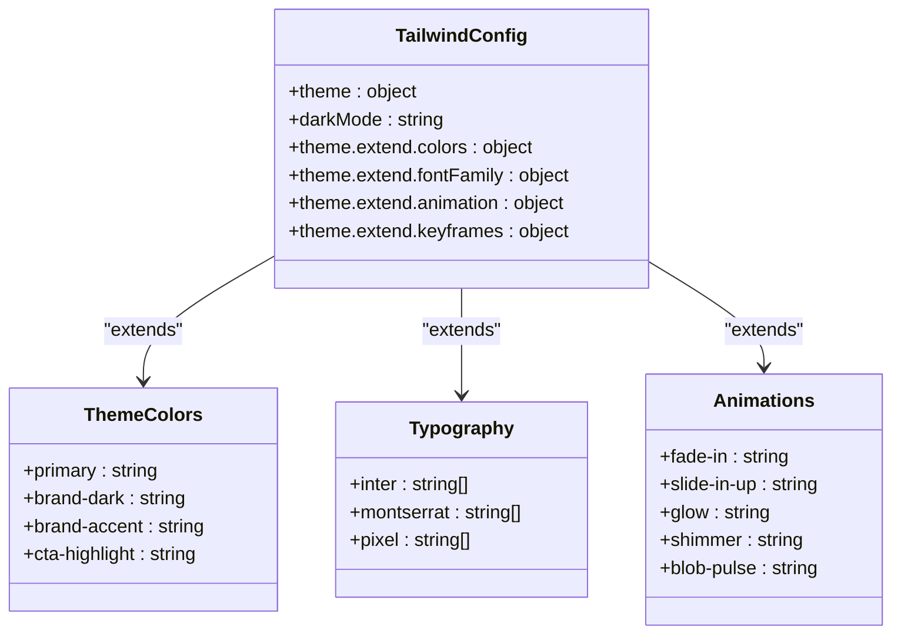

# Styling Strategy

<cite>
**Referenced Files in This Document**   
- [App.tsx](file://App.tsx)
- [index.html](file://index.html)
- [Header.tsx](file://components/Header.tsx)
- [HeroSection.tsx](file://components/HeroSection.tsx)
- [Footer.tsx](file://components/Footer.tsx)
</cite>

## Table of Contents
1. [Utility-First Approach with Tailwind CSS](#utility-first-approach-with-tailwind-css)
2. [Tailwind Configuration and Theme Extensions](#tailwind-configuration-and-theme-extensions)
3. [Global Styles and Dark Mode Implementation](#global-styles-and-dark-mode-implementation)
4. [Component-Specific Styling Patterns](#component-specific-styling-patterns)
5. [Responsive Design and Breakpoint Usage](#responsive-design-and-breakpoint-usage)
6. [Accessibility Considerations](#accessibility-considerations)
7. [Performance Optimization and CSS Management](#performance-optimization-and-css-management)
8. [Integration with Component Logic](#integration-with-component-logic)

## Utility-First Approach with Tailwind CSS

The application implements a utility-first styling approach using Tailwind CSS, enabling rapid UI development directly within JSX components. This methodology allows developers to compose styles using atomic utility classes rather than writing custom CSS, significantly accelerating the development process. The utility classes are applied directly to JSX elements through the `className` attribute, creating a tight integration between markup and presentation. This approach eliminates context switching between files and enables immediate visual feedback during development. The codebase demonstrates extensive use of Tailwind's responsive prefixes, state variants, and theme-aware utilities to create a cohesive design system that adapts to different screen sizes and user preferences.

**Section sources**
- [App.tsx](file://App.tsx#L40-L49)
- [Header.tsx](file://components/Header.tsx#L80-L90)
- [HeroSection.tsx](file://components/HeroSection.tsx#L167-L178)

## Tailwind Configuration and Theme Extensions

The Tailwind configuration, defined inline within the `index.html` file, extends the default theme with custom design tokens that establish the application's visual identity. The configuration includes a custom color palette with `primary: '#FF5630'` as the brand accent color, along with `brand-dark`, `brand-accent`, and `cta-highlight` for consistent theming across components. Typography is enhanced with custom font families including Inter, Montserrat, and VT323 (pixel font) for specific design elements. The configuration also defines a comprehensive set of custom animations and keyframes for interactive elements, including `fadeIn`, `slideInUp`, `glow`, `shimmer`, and `blob-pulse` effects that enhance the user experience. These animations are applied using Tailwind's animation utilities throughout the application.

**Diagram sources**
- [index.html](file://index.html#L85-L169)

## Global Styles and Dark Mode Implementation

Global styles are implemented through a combination of Tailwind's built-in directives and custom CSS within the `index.html` file. The application establishes a consistent base style for typography, spacing, and layout, with special attention to dark mode support. The `darkMode: 'class'` configuration enables theme switching by toggling the `dark` class on the document element, which is managed in the `App.tsx` component through the `toggleTheme` function. Global styles include custom scrollbar designs that adapt to the current theme, with neutral gray track colors in light mode and darker grays in dark mode, while maintaining the brand primary color for hover states. The application also implements custom prose styles for blog content, with theme-aware color variables for text, links, and borders that ensure readability across both light and dark themes.

**Section sources**
- [App.tsx](file://App.tsx#L223-L260)
- [index.html](file://index.html#L169-L234)

## Component-Specific Styling Patterns

Component-specific styling is implemented using Tailwind's utility classes within each component's JSX, creating self-contained styling that travels with the component. The `Header.tsx` component demonstrates this approach with a fixed navigation bar that uses backdrop blur effects, semi-transparent backgrounds, and theme-aware text colors. Interactive elements like buttons and menus employ hover states, focus rings, and transition effects to provide visual feedback. The `HeroSection.tsx` component showcases advanced styling patterns including gradient text effects, animated typing indicators, and shimmer animations that draw user attention to key content. Form elements across the application use consistent styling patterns with rounded inputs, focus states, and validation feedback that maintain visual harmony while providing clear user guidance.

**Section sources**
- [Header.tsx](file://components/Header.tsx#L173-L199)
- [HeroSection.tsx](file://components/HeroSection.tsx#L167-L175)
- [Footer.tsx](file://components/Footer.tsx#L11-L87)

## Responsive Design and Breakpoint Usage

The application implements a comprehensive responsive design strategy using Tailwind's breakpoint prefixes to create layouts that adapt to different screen sizes. The design system employs a mobile-first approach with base styles for small screens and progressive enhancement for larger viewports. The `CalendlyModal.tsx` component demonstrates sophisticated responsive logic that adjusts modal dimensions based on viewport size and aspect ratio, providing optimal viewing experiences across mobile, tablet, and desktop devices. Blog content utilizes responsive tables that transform from traditional tabular layouts on desktop to stacked card-like presentations on mobile, with data labels positioned absolutely to maintain context. Typography scales appropriately across breakpoints, with font sizes, padding, and spacing adjusted to maintain readability and visual hierarchy on all devices.

**Section sources**
- [CalendlyModal.tsx](file://components/CalendlyModal.tsx#L35-L78)
- [index.html](file://index.html#L274-L317)

## Accessibility Considerations

Accessibility is integrated into the styling architecture through careful attention to color contrast, focus states, and semantic HTML structure. The application maintains sufficient contrast ratios between text and background colors in both light and dark modes, with primary text colors (`text-gray-900` in light mode, `text-white` in dark mode) ensuring readability. Interactive elements include visible focus rings and hover states that accommodate users with different interaction preferences. The styling system incorporates ARIA attributes and semantic class names to enhance screen reader accessibility, with visually hidden elements properly managed using techniques like `clip: rect(0 0 0 0)` for table headers on mobile while maintaining accessibility. Form inputs include appropriate labels and error messaging with sufficient color contrast to ensure all users can understand and complete forms successfully.

**Section sources**
- [index.html](file://index.html#L315-L356)
- [Footer.tsx](file://components/Footer.tsx#L11-L87)

## Performance Optimization and CSS Management

The styling architecture prioritizes performance through several optimization strategies. The application leverages Tailwind's Just-In-Time (JIT) compiler, which generates styles on-demand, significantly reducing the final CSS bundle size by including only the utility classes actually used in the codebase. The configuration includes animation optimizations with `transform` and `opacity` properties that leverage hardware acceleration for smooth performance. The application minimizes unused CSS by avoiding arbitrary values and sticking to the defined theme scale, ensuring consistency while maintaining efficiency. Background effects and complex animations are carefully managed to prevent performance degradation, with the `Background.tsx` component using canvas-based particle animations that are optimized for both light and dark themes without excessive DOM manipulation.

**Section sources**
- [index.html](file://index.html#L85-L169)
- [Background.tsx](file://components/Background.tsx#L177-L202)

## Integration with Component Logic

Styling is tightly integrated with component logic and state management, creating dynamic interfaces that respond to user interactions and application state. The theme state is managed in the `App.tsx` component and passed down as a prop to child components, enabling theme-aware styling decisions throughout the application. Conditional class names are used extensively to reflect component state, such as loading indicators, form validation states, and interactive feedback. The `Header.tsx` component demonstrates this integration with menu state management that controls the visibility of dropdown menus and mobile navigation. Animation states are synchronized with component lifecycle events, with enter/exit transitions triggered by state changes to create smooth user experiences. This tight coupling between styling and logic ensures that visual feedback is immediate and consistent with the application's behavior.

**Section sources**
- [App.tsx](file://App.tsx#L223-L260)
- [Header.tsx](file://components/Header.tsx#L10-L243)
- [HeroSection.tsx](file://components/HeroSection.tsx#L167-L432)