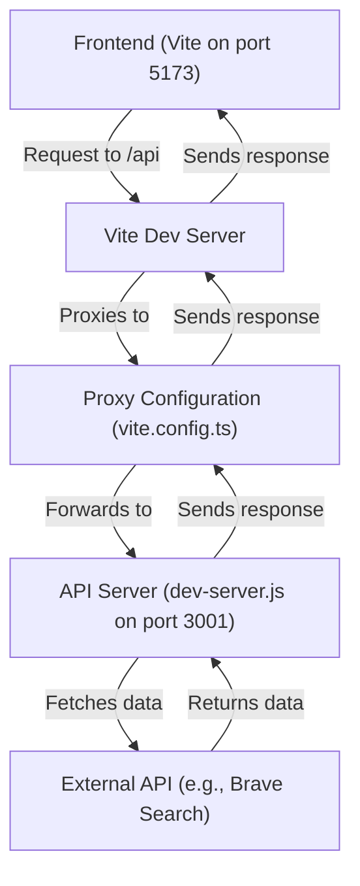
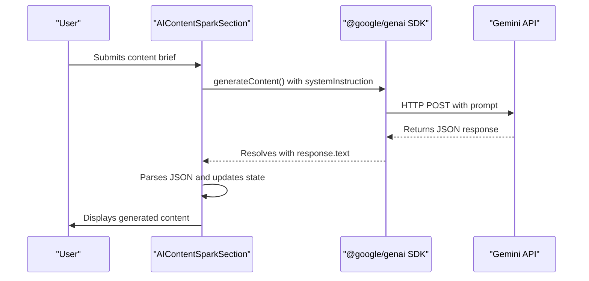

# Technology Stack & Dependencies

<cite>
**Referenced Files in This Document**   
- [package.json](file://package.json)
- [vite.config.ts](file://vite.config.ts)
- [tsconfig.json](file://tsconfig.json)
- [vercel.json](file://vercel.json)
- [dev-server.js](file://dev-server.js)
- [services/supabase.ts](file://services/supabase.ts)
- [services/analytics.ts](file://services/analytics.ts)
- [components/admin/AiLinkManagerModal.tsx](file://components/admin/AiLinkManagerModal.tsx)
- [components/admin/BlogEditorModal.tsx](file://components/admin/BlogEditorModal.tsx)
- [components/admin/TableEditorModal.tsx](file://components/admin/TableEditorModal.tsx)
- [components/AIContentSparkSection.tsx](file://components/AIContentSparkSection.tsx)
- [components/AIQuizSection.tsx](file://components/AIQuizSection.tsx)
- [components/AIWebsiteAuditorSection.tsx](file://components/AIWebsiteAuditorSection.tsx)
- [components/AIKnowledgeBaseGeneratorSection.tsx](file://components/AIKnowledgeBaseGeneratorSection.tsx)
- [components/AIEmailSubjectLineTesterSection.tsx](file://components/AIEmailSubjectLineTesterSection.tsx)
</cite>

## Table of Contents
1. [Core Technology Stack](#core-technology-stack)
2. [Critical Dependencies](#critical-dependencies)
3. [Configuration Files](#configuration-files)
4. [Integration Examples](#integration-examples)
5. [Version Compatibility & Security](#version-compatibility--security)
6. [Performance Implications](#performance-implications)
7. [Development & Extension Guidance](#development--extension-guidance)

## Core Technology Stack

The synaptix-studio-website-app is built on a modern, efficient technology stack designed for rapid development, type safety, and high performance. The core stack consists of React for UI rendering, Vite as the build tool, TypeScript for type safety, and Tailwind CSS for utility-first styling.

**React** serves as the foundational UI library, enabling the creation of a dynamic, component-based user interface. Its declarative nature and virtual DOM ensure efficient rendering and a responsive user experience. The application leverages React's component architecture extensively, with a clear separation of concerns between UI components, admin tools, and AI-powered features.

**Vite** is the chosen build tool, providing a lightning-fast development server and an optimized build process. It leverages native ES modules for near-instantaneous hot module replacement (HMR), significantly improving developer productivity. Vite's modern approach eliminates the need for complex bundler configurations, offering a streamlined development experience.

**TypeScript** is used throughout the codebase to enforce type safety. This provides compile-time error checking, enhances code maintainability, and improves the developer experience with better tooling support (e.g., autocompletion, refactoring). The `tsconfig.json` file defines the strict type-checking rules that the project adheres to.

**Tailwind CSS** is the utility-first CSS framework used for styling. It allows developers to apply design directly in the markup using pre-defined utility classes, promoting consistency and enabling rapid UI development. The combination of Tailwind with React's component model results in highly maintainable and visually consistent UIs.

**Section sources**
- [package.json](file://package.json#L1-L45)
- [vite.config.ts](file://vite.config.ts#L1-L22)
- [tsconfig.json](file://tsconfig.json#L1-L28)

## Critical Dependencies

The application's functionality is powered by a set of critical dependencies, each serving a specific purpose. These are categorized into runtime dependencies and development dependencies.

### Runtime Dependencies
- **@google/genai**: This is the official Google Generative AI SDK, which is the cornerstone of the application's AI capabilities. It is used to interact with the Gemini API for content generation, analysis, and other AI-driven features. Components like `AIContentSparkSection`, `AIQuizSection`, and `AIWebsiteAuditorSection` use this library to generate content, analyze websites, and provide strategic insights.
- **@supabase/supabase-js**: This is the official Supabase client library for JavaScript/TypeScript. It is used for all database operations, including saving form submissions, managing blog posts, and storing user data. The `services/supabase.ts` file encapsulates all interactions with the Supabase backend, providing a clean API for the rest of the application.
- **react** and **react-dom**: These are the core React libraries for building the user interface and rendering it to the DOM.
- **jspdf**: This library is used by the `AIWebsiteAuditorSection` to generate downloadable PDF reports from the audit results.

### Development Dependencies
- **@testing-library/react** and **vitest**: These are the primary tools for testing. Vitest is a fast, Vite-native test runner, while @testing-library/react provides utilities for testing React components in a way that simulates real user interactions.
- **@vitejs/plugin-react**: This Vite plugin is essential for supporting React's JSX syntax and Fast Refresh feature during development.
- **typescript**: This is required to compile the TypeScript code into JavaScript.
- **concurrently**: This tool is used in the `dev:full` script to run both the Vite development server and the custom API server (`dev-server.js`) simultaneously.
- **express**, **cors**, and **dotenv**: These are used to create a local development API server (`dev-server.js`) that proxies requests to external APIs like Brave Search, allowing for secure handling of API keys.

**Section sources**
- [package.json](file://package.json#L1-L45)
- [services/supabase.ts](file://services/supabase.ts#L1-L277)
- [components/AIContentSparkSection.tsx](file://components/AIContentSparkSection.tsx#L1-L330)
- [components/AIQuizSection.tsx](file://components/AIQuizSection.tsx#L1-L218)
- [components/AIWebsiteAuditorSection.tsx](file://components/AIWebsiteAuditorSection.tsx#L1-L440)
- [dev-server.js](file://dev-server.js#L1-L80)

## Configuration Files

The project is configured through several key files that define its build process, type-checking rules, and deployment settings.

### vite.config.ts
This file configures the Vite build tool. Key configurations include:
- **Plugins**: The `@vitejs/plugin-react` plugin is used to enable React support.
- **Build Output**: The `build.outDir` is set to `dist`, which is the standard output directory for the production build.
- **Development Server Proxy**: A proxy is configured for the `/api` path, which forwards requests to `http://localhost:3001`. This allows the frontend to make API calls to the local `dev-server.js` without CORS issues during development.

**Diagram sources **
- [vite.config.ts](file://vite.config.ts#L1-L22)
- [dev-server.js](file://dev-server.js#L1-L80)

### tsconfig.json
This file defines the TypeScript compiler options. The configuration is strict, with `"strict": true`, which enables a broad set of type-checking rules. Key settings include:
- **Target**: `ES2020`, ensuring compatibility with modern JavaScript features.
- **Module Resolution**: Set to `bundler`, which is the recommended setting for modern tooling like Vite.
- **JSX**: Set to `react-jsx`, which enables the use of React's JSX syntax.
- **Strict Null Checks**: Although `"strictNullChecks": false`, the overall `"strict": true` setting ensures a high level of type safety.

**Section sources**
- [tsconfig.json](file://tsconfig.json#L1-L28)

### vercel.json
This file contains the deployment configuration for Vercel. It specifies:
- **Framework**: Set to `vite`, which tells Vercel to use the Vite framework preset.
- **Build Command**: `npm run build`, which runs the TypeScript compilation and Vite build process.
- **Output Directory**: `dist`, which is where the built files are placed.
- **Rewrites**: A catch-all rewrite rule (`/(.*)` to `/index.html`) is used to support client-side routing (e.g., React Router).
- **Headers**: Security headers are configured, including `X-Frame-Options: DENY` to prevent clickjacking and `X-Content-Type-Options: nosniff` to prevent MIME type sniffing.

**Section sources**
- [vercel.json](file://vercel.json#L1-L60)

## Integration Examples

The technologies in the stack are seamlessly integrated to create a cohesive and powerful application. Here are key examples of how they work together.

### Vite Development Server Setup
The `dev-server.js` file demonstrates a practical integration of Vite with a custom Express server. This setup is crucial for handling API routes that require server-side logic, such as securely managing API keys. The Vite development server proxies requests to this Express server, allowing the frontend to make requests to `/api/brave` while the actual API call to the Brave Search API is made from the server, keeping the `BRAVE_API_KEY` secure in the environment variables.

### Environment Variable Handling
The application uses environment variables extensively for configuration. The `dev-server.js` file uses the `dotenv` package to load variables from a `.env.local` file. The Vite configuration automatically exposes environment variables prefixed with `VITE_` to the client-side code, which is used to access the `VITE_GEMINI_API_KEY` in components like `AIContentSparkSection`.

### AI Content Generation Flow
A prime example of integration is the AI content generation flow in the `AIContentSparkSection`. When a user submits a form, the component uses the `@google/genai` SDK to call the Gemini API. The request is structured with a detailed `systemInstruction` that defines the output format as JSON. The response is then parsed and displayed to the user, with the entire process being tracked using the `analytics.ts` service.

**Diagram sources **
- [components/AIContentSparkSection.tsx](file://components/AIContentSparkSection.tsx#L1-L330)
- [dev-server.js](file://dev-server.js#L1-L80)

## Version Compatibility & Security

The project specifies exact versions for Node.js and npm in the `engines` field of `package.json`, ensuring consistent development and deployment environments. The current versions are Node.js 22.4.1 and npm 10.8.1.

Security is addressed through multiple layers:
- **Environment Variables**: Sensitive API keys (e.g., `BRAVE_API_KEY`, `VITE_GEMINI_API_KEY`) are never hardcoded. They are loaded from environment files or provided at runtime.
- **CORS**: The `dev-server.js` explicitly configures CORS to allow requests only from the Vite development server origins (`http://localhost:3000`, `http://localhost:5173`), preventing unauthorized access.
- **Security Headers**: The `vercel.json` file configures critical security headers like `X-Frame-Options` and `X-Content-Type-Options` to protect against common web vulnerabilities.
- **Input Validation**: The `AiLinkManagerModal` performs validation on user input, such as checking for a missing `q` parameter in the Brave API request, and logs errors for debugging without exposing sensitive information.

**Section sources**
- [package.json](file://package.json#L42-L45)
- [dev-server.js](file://dev-server.js#L1-L80)
- [vercel.json](file://vercel.json#L1-L60)
- [components/admin/AiLinkManagerModal.tsx](file://components/admin/AiLinkManagerModal.tsx#L1-L531)

## Performance Implications

The chosen stack has significant positive performance implications:
- **Vite**: Its use of native ES modules and on-demand compilation results in extremely fast cold starts and HMR, drastically reducing development time.
- **React**: The virtual DOM minimizes direct manipulation of the real DOM, leading to efficient updates and a smooth user experience.
- **TypeScript**: While it adds a compilation step, the type safety it provides reduces runtime errors and the need for extensive debugging, improving long-term performance and maintainability.
- **Tailwind CSS**: By generating a highly optimized CSS file during the build process, it ensures that only the CSS that is actually used is delivered to the client, minimizing bundle size.

The `vite.config.ts` file further optimizes the build by setting `build.assetsDir` to `assets`, which helps organize and potentially cache static assets more effectively.

**Section sources**
- [vite.config.ts](file://vite.config.ts#L1-L22)
- [package.json](file://package.json#L1-L45)

## Development & Extension Guidance

Developers can extend or modify the stack with the following guidance:
- **Adding New AI Features**: To add a new AI-powered tool, create a new component in the `components` directory. Use the `@google/genai` SDK with a well-crafted `systemInstruction` to define the AI's behavior. Ensure the component handles loading states and errors gracefully.
- **Modifying the Build Process**: Any changes to the build process should be made in `vite.config.ts`. For example, adding a new plugin or changing the output directory.
- **Updating Dependencies**: Use `npm` to update dependencies. Always check for breaking changes, especially when updating major versions of React, Vite, or TypeScript.
- **Replacing Components**: The stack is modular. For instance, Tailwind CSS could be replaced with another CSS-in-JS solution, or Vite could be replaced with Webpack, though this would require significant configuration changes.

The use of `concurrently` in the `dev:full` script provides a convenient way to run the full development environment, which is essential for testing any new features that rely on the local API server.

**Section sources**
- [package.json](file://package.json#L1-L45)
- [vite.config.ts](file://vite.config.ts#L1-L22)
- [dev-server.js](file://dev-server.js#L1-L80)