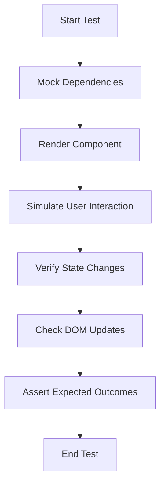

# Testing Strategy

<cite>
**Referenced Files in This Document**   
- [vitest.config.ts](file://vitest.config.ts)
- [src\test\setup.ts](file://src/test/setup.ts)
- [src\test\ContactSection.test.tsx](file://src/test/ContactSection.test.tsx)
- [src\test\Header.test.tsx](file://src/test/Header.test.tsx)
- [src\test\HeroSection.test.tsx](file://src/test/HeroSection.test.tsx)
- [components\ContactSection.tsx](file://components/ContactSection.tsx)
- [components\Header.tsx](file://components/Header.tsx)
- [components\HeroSection.tsx](file://components/HeroSection.tsx)
</cite>

## Table of Contents
1. [Testing Framework and Configuration](#testing-framework-and-configuration)
2. [Test Organization and Structure](#test-organization-and-structure)
3. [Testing Patterns and Methodologies](#testing-patterns-and-methodologies)
4. [Component-Specific Test Cases](#component-specific-test-cases)
5. [Code Coverage and Development Workflow](#code-coverage-and-development-workflow)
6. [Current Limitations and Future Enhancements](#current-limitations-and-future-enhancements)
7. [Developer Guidance for Writing Tests](#developer-guidance-for-writing-tests)

## Testing Framework and Configuration

The synaptix-studio-website-app utilizes Vitest as its primary testing framework, providing a fast and efficient solution for unit testing React components. The test configuration is defined in `vitest.config.ts`, which sets up the testing environment with essential parameters for component testing. The configuration includes the React plugin to support JSX syntax, sets the testing environment to jsdom for DOM manipulation, and enables global access to testing utilities. A custom setup file at `./src/test/setup.ts` is specified to initialize the testing environment with consistent mocks and configurations across all test files. The test timeout is increased to 15 seconds to accommodate asynchronous operations that may occur during component rendering and interaction.

**Section sources**
- [vitest.config.ts](file://vitest.config.ts#L1-L12)

## Test Organization and Structure

Tests are organized in the `src\test` directory, following a clear and maintainable structure that mirrors the component hierarchy. Each critical component has its corresponding test file, such as `ContactSection.test.tsx`, `Header.test.tsx`, and `HeroSection.test.tsx`, which contain comprehensive test suites for their respective components. This co-location strategy makes it easy for developers to find and understand the tests associated with specific components. The setup file `setup.ts` provides a centralized location for configuring the testing environment, including mocks for browser APIs and external dependencies that components rely on. This approach ensures consistency across tests while reducing duplication of setup code.

**Section sources**
- [src\test\setup.ts](file://src/test/setup.ts#L1-L84)
- [src\test\ContactSection.test.tsx](file://src/test/ContactSection.test.tsx#L1-L248)
- [src\test\Header.test.tsx](file://src/test/Header.test.tsx#L1-L112)
- [src\test\HeroSection.test.tsx](file://src/test/HeroSection.test.tsx#L1-L244)

## Testing Patterns and Methodologies

The testing approach employs several key patterns to ensure robust and reliable component testing. External dependencies are extensively mocked using Vitest's `vi.mock()` function, allowing for isolated testing of components without relying on actual API calls or external services. For example, the ContactSection component mocks the Google GenAI service, analytics tracking, and Supabase database operations to test the component's behavior in a controlled environment. Browser APIs such as `matchMedia`, `IntersectionObserver`, and `ResizeObserver` are mocked in the setup file to ensure consistent behavior across different testing environments. User interactions are simulated using `@testing-library/user-event`, which provides a realistic way to test form submissions, button clicks, and other user actions. The tests also verify component rendering and state changes, ensuring that components update correctly in response to user input and asynchronous operations.

**Diagram sources**
- [src\test\setup.ts](file://src/test/setup.ts#L1-L84)
- [src\test\ContactSection.test.tsx](file://src/test/ContactSection.test.tsx#L1-L248)

## Component-Specific Test Cases

### ContactSection Testing
The ContactSection component is thoroughly tested to ensure its form validation, API integration, and UI state management work correctly. Test cases verify that the form renders with all required fields, validates user input, and displays appropriate error messages when required fields are missing. The component's integration with the AI strategy generation service is tested by mocking the Google GenAI API response and verifying that the component correctly processes and displays the AI-generated content. Tests also validate the functionality of the download and copy buttons, ensuring that users can save the AI strategy report as a PDF or copy it to their clipboard.

**Section sources**
- [components\ContactSection.tsx](file://components/ContactSection.tsx#L12-L397)
- [src\test\ContactSection.test.tsx](file://src/test/ContactSection.test.tsx#L1-L248)

### Header Component Testing
The Header component tests focus on navigation functionality, theme toggling, and responsive behavior. Test cases verify that the header renders with the correct logo and navigation links, and that clicking on navigation items triggers the appropriate navigation function. The theme toggle button is tested to ensure it calls the toggleTheme function when clicked. Tests also validate the mobile menu functionality, ensuring that the menu opens and closes correctly and that navigation works in the mobile view. The component's responsive behavior is tested by simulating different viewport sizes and verifying that the appropriate navigation elements are displayed.

**Section sources**
- [components\Header.tsx](file://components/Header.tsx#L10-L243)
- [src\test\Header.test.tsx](file://src/test/Header.test.tsx#L1-L112)

### HeroSection Testing
The HeroSection component tests focus on the newsletter subscription form, floating services carousel, and call-to-action functionality. Test cases verify that the email subscription form validates user input, displays appropriate error messages for invalid emails, and successfully submits the form data. The integration with the Calendly scheduling system is tested by verifying that clicking the consultation button calls the openCalendlyModal function. Tests also validate the cycling of animated button text, ensuring that the dynamic content updates correctly over time. The component's social proof section is tested to ensure that contact information and partner logos are displayed correctly.

**Section sources**
- [components\HeroSection.tsx](file://components/HeroSection.tsx#L167-L432)
- [src\test\HeroSection.test.tsx](file://src/test/HeroSection.test.tsx#L1-L244)

## Code Coverage and Development Workflow

The testing strategy contributes significantly to the development workflow by providing a safety net for refactoring and new feature development. The comprehensive test suite ensures that changes to components do not introduce regressions, allowing developers to make improvements with confidence. The tests serve as living documentation of component behavior, making it easier for new team members to understand how components should work. The use of Vitest's watch mode enables rapid feedback during development, automatically running relevant tests when code changes are made. This immediate feedback loop helps catch issues early in the development process, reducing debugging time and improving code quality. The test suite is designed to be run as part of the CI/CD pipeline, ensuring that all tests pass before code is deployed to production.

**Section sources**
- [vitest.config.ts](file://vitest.config.ts#L1-L12)
- [src\test\setup.ts](file://src/test/setup.ts#L1-L84)

## Current Limitations and Future Enhancements

While the current testing approach provides solid coverage for unit testing React components, there are opportunities for enhancement. The test suite currently focuses on unit tests and does not include end-to-end testing, which would provide additional confidence in the application's overall functionality. Adding end-to-end testing with tools like Cypress or Playwright would allow for testing user flows across multiple components and pages, simulating real user interactions with the application. This would help identify issues that might not be caught by unit tests, such as navigation problems or integration issues between components. Additionally, visual regression testing could be implemented to detect unintended UI changes. The test suite could also benefit from more comprehensive accessibility testing to ensure the application is usable by all users.

**Section sources**
- [src\test\ContactSection.test.tsx](file://src/test/ContactSection.test.tsx#L1-L248)
- [src\test\Header.test.tsx](file://src/test/Header.test.tsx#L1-L112)
- [src\test\HeroSection.test.tsx](file://src/test/HeroSection.test.tsx#L1-L244)

## Developer Guidance for Writing Tests

When writing tests for new components in the synaptix-studio-website-app, developers should follow several best practices to ensure consistency and effectiveness. First, create a test file in the `src\test` directory with a name that matches the component being tested, using the `.test.tsx` extension. Import the necessary testing utilities from Vitest and Testing Library, and mock any external dependencies the component relies on. Write descriptive test names that clearly communicate what is being tested and the expected outcome. Focus on testing the component's public interface and user-facing behavior rather than implementation details, making tests more resilient to refactoring. Use `@testing-library/user-event` to simulate realistic user interactions, and verify the component's state and DOM updates after each interaction. Finally, ensure that tests are isolated and do not depend on the state of other tests, using `beforeEach` and `afterEach` hooks to set up and clean up the testing environment as needed.

**Section sources**
- [src\test\setup.ts](file://src/test/setup.ts#L1-L84)
- [src\test\ContactSection.test.tsx](file://src/test/ContactSection.test.tsx#L1-L248)